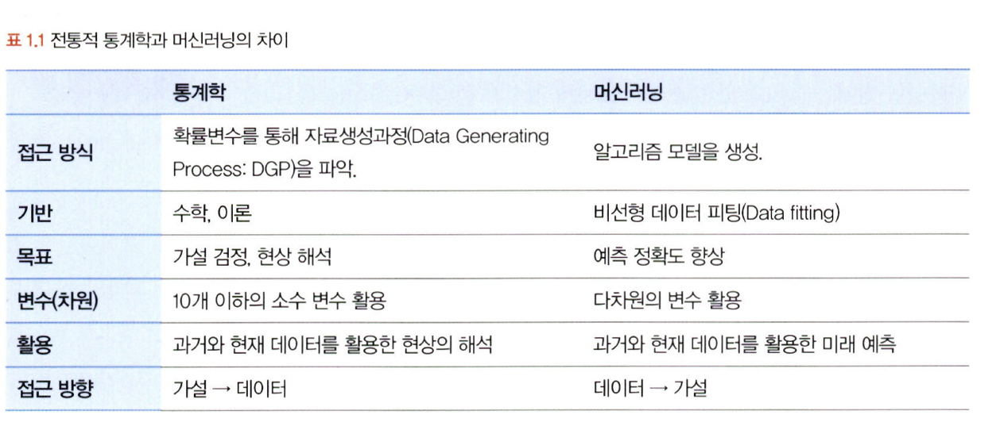
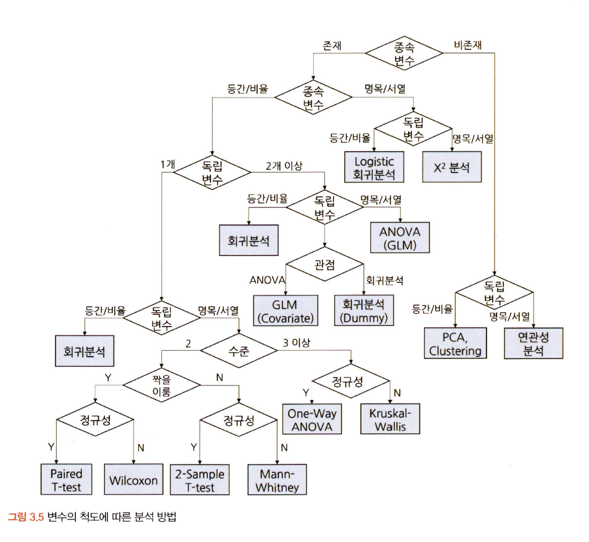
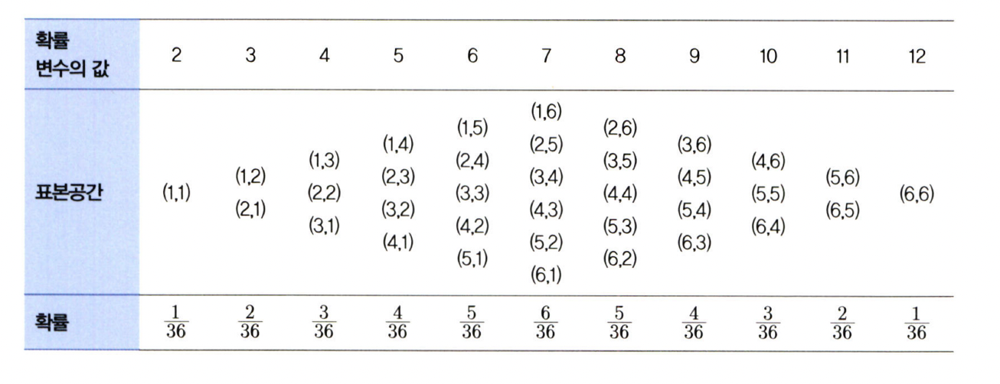

# 통계학 1주차 정규과제

📌통계학 정규과제는 매주 정해진 분량의 『*데이터 분석가가 반드시 알아야 할 모든 것*』 을 읽고 학습하는 것입니다. 이번 주는 아래의 **Statistics_1st_TIL**에 나열된 분량을 읽고 `학습 목표`에 맞게 공부하시면 됩니다.

아래의 문제를 풀어보며 학습 내용을 점검하세요. 문제를 해결하는 과정에서 개념을 스스로 정리하고, 필요한 경우 추가자료와 교재를 다시 참고하여 보완하는 것이 좋습니다.

1주차는 `1부. 데이터 기초체력 기르기`를 읽고 새롭게 배운 내용을 정리해주시면 됩니다.


## Statistics_1st_TIL

### 1부. 데이터 기초체력 기르기
### 01. 통계학 이해하기
### 02. 모집단과 표본추출
### 03. 변수와 척도
### 04. 데이터의 기술 통계적 측정
### 05. 확률과 확률변수

## Study Schedule

|주차 | 공부 범위     | 완료 여부 |
|----|----------------|----------|
|1주차| 1부 p.2~56     | ✅      |
|2주차| 1부 p.57~79    | 🍽️      | 
|3주차| 2부 p.82~120   | 🍽️      | 
|4주차| 2부 p.121~202  | 🍽️      | 
|5주차| 2부 p.203~254  | 🍽️      | 
|6주차| 3부 p.300~356  | 🍽️      | 
|7주차| 3부 p.357~615  | 🍽️      | 

<!-- 여기까진 그대로 둬 주세요-->

# 01. 통계학 이해하기

```
✅ 학습 목표 :
* 통계학의 필요성에 대해 인식한다.
* 기술통계와 추론통계의 특성을 구분할 수 있다.
```
### 1.1 왜 통계학을 알아야할까
* 데이터 과학의 전체 프로세스
    * 데이터 수집 > 데이터 가공 > 탐색적 데이터 분석(EDA) 및 데이터 시각화 > M/L 모델링 > 결과 및 해석 적용

### 1.2 머신러닝과 전통 통계학의 차이
* 머신러닝: 예측
* 통계학: 해석
    * 각 변수의 영향력에 대한 해석, 샘플의 가정과 통계적 적합성에 집중한다. 



### 1.4 기술통계와 추론통계
* 기술통계: 데이터의 특성을 사실에 근거하여 설명하고 묘사
* 추론통계: 표본집단으로부터 모집단 특성 추론


# 02. 모집단과 표본추출

```
✅ 학습 목표 :
* 모집단과 표본의 정의와 관계를 설명할 수 있다.
* 편향과 분산의 차이를 설명할 수 있다.
```

### 2.1 모집단과 표본, 전수조사와 표본조사
* 모집단 -> (표본추출) -> 샘플
* 모수 <- (추정 및 검정) <- 검정통계량
*! 전체의 빅데이터를 사용한다고 해도 실제 모수를 대표하는 것은 아니며 이상치와 편향이 존재함.*

### 2.2 표본조사를 하는 이유와 데이터과학 적용 방법
* 표지 재포획법: 표본의 일부를 재포획하여 모수를 추정하는 방법

### 2.3 표본추출에서 나타나는 편향의 종류
* 표본오차: 모집단과 표본의 차이를 보여주는 지표로, 표본이 작을수록 오차값이 크다. 
* 비표본오차: ex. 편향
*! 표본 편향은 확률화 (모집단으로부터 편향이 발생하지 않는 표본을 추출하는 방법)를 통해 최소화 or X 가능.*


### 2.5 머신러닝 모델 측면의 편향과 분산
* 머신러닝에서 편향과 분산은 트레이드오프 관계 
    * 편향: 예측값과 정답이 가까운 정도
    * 분산: 예측값의 변동성

### 2.6 표본 편향을 최소화하기 위한 표본 추출 방법
* 모집단 확정 > 표본 프레임 결정 > 표본 추출방법 결정 > 표본크기 결정 > 표본추출

* 표본 추출방법 중 모집단의 크기가 크지 않거나, 추출하는 표본이 20% 이상 많은 경우 복원추출이 편향을 줄일 수 있다. 

# 03. 변수와 척도
```
✅ 학습 목표 :
* 독립변수, 종속변수의 관계를 파악할 수 있다.
* 척도(변수의 데이터적 속성)의 종류를 설명할 수 있다.
```

### 3.1 변수의 종류
* 가감승제로 연산 가능한지
    * 양적변수
        * 이산변수: 정수값만
        * 연속변수: 연속적인 실숫값
    * 질적변수
        * 비계량적 변수

* 변수의 관계적 측면
    * 독립변수 (피쳐)
    * 종속변수 (표적변수)
    * 통제변수: 종속변수에 영향을 주는 외부 요소 통제
*! 기본적으로 두 변수는 상관관계이며, 두 독립변수 간 상관관계를 가질 수 있다. *

### 3.2 변수 관계와 종류
* 인과관계
* 상관관계
* 독립관계 
* 의사관계: 변수 간 상관성은 있지만, 그 상관성이 다른 변수에 의해 나타난 관계. (통계 수치에만 연연X)
* 양방향적 인과관계: 두 변수가 인과관게
* 조절관계: 독립 및 종속 변수 사이 불확정적 영향을 미치는 관계 (조절변수의 투입)
    * 회귀선의 기울기가 달라짐 (방향 변경)
* 매개관계: 매개변수의 개입으로 독립변수의 영향을 종속변수에 전달.
    * 독립변수 및 종속변수의 직접적 관계가 약해짐 (인과관계 중개)

*! 두 변수가 독립관계가 아니어도 상관계수가 0이 되는 허점 존재. *

### 3.3 척도의 종류
* 범주형
    * 명목 척도
    * 서열 척도
* 연속형 
    * 등간 척도
    * 비율 척도




# 04. 데이터의 기술 통계적 측정

```
✅ 학습 목표 :
* 산포도의 의미를 설명하고 측정방법을 나열할 수 있다.
* 정규분포의 왜도값과 첨도값이 얼마인지 답할 수 있다.
```
* 평균
    * 산술평균: 기본
    * 가중평균: 가중치 
    * 기하평균: 시간에 따라 변화하는 비율 평균 계산
    * 조화평균: 시간에 따라 변화하는 값 평균 계산

* 자유도
    * 표본평균 구할 시 분모에 n-1
    * 표본이 모집단보다 분산이 작게 계산되는 경향이 있음. 

* 변동계수: 표준 편차 / 산술평균
    * 서로 다른 두 자료의 산포도 비교 가능 (편차의 표준화)
    * 평균이 0에 가까운 경우 무한대값 발생 가능

* 왜도
    * 피어슨의 비대칭 계수: 3(평균값 - 중앙값 or 최빈값) / 표준편차 
        * 세 지표의 거리가 달라지는 원리 이용

* 첨도
    * 양의 첨도: 분포가 작음
    * 음의 첨도: 분포가 큼


# 05. 확률과 확률변수

```
✅ 학습 목표 :
* 확률변수의 개념과 종류를 설명할 수 있다.
* 심슨의 역설을 설명하고, 발생 원인을 식별하며, 이를 해결하기 위한 방안을 도출할 수 있다.
```

### 5-1. 확률의 기본 개념
* 확률: 일정한 조건 안에서 특정 사건이 일어날 수 있는 가능성의 정도

### 5-2. 확률의 종류
* 비조건확률: 아무런 조건없이 상황이 일어날 확률
    * P(A), P(B)
* 결합확률: 두 개의 사건이 동시에
    * P(A∩B)
* 조건부확률: 하나의 사건 발생 뒤, 또 다른 사건이 발생될 확률 P(B|A)

### 5-3. 분할과 베이지안 이론
* 분할: 사건들을 합했을 때, 전체 사건들을 포함하되 중복이 일어나지 않는 사건들의 집합
    * 이때, 핵심은 '사건들을 합했을 때'. 주사위에서 1이 나올 확률과 짝수가 나올 확률은 분할이X
* 베이지안 이론: 사건 발생 전 가지고 있는 사전확률 p(A)와 우도확률 p(B|A)를 알면, 사후 확률 p(A|B) 를 알 수 있다. 
    * 공식: P(A∣B)= P(B∣A)⋅P(A) / P(B)
​
### 5-4. 확률변수의 개념과 종류
* 확률변수: 측정 값이 변할 수 있는 확률이 주어진 변수
    * ex. 표본추출에 따라 통계량이 달라지는 표본 평균, 표본 분산
    * P(X)에서 X는 사건, P(X)는 확률이며 이때 X를 변화하는 숫자로 보는 것이 확률변수



* 확률변수
    * 이산확률변수
    * 연속확률변수

### 5-5. 심슨의 역설
* 데이터를 볼 때는 데이터의 세부 비중을 살펴봐야 함.

<br>
<br>

# 확인 문제

## 문제 1.

> **🧚Q. 한 대형 병원이 두 명의 외과 의사(A와 B)의 수술 성공률을 비교하려고 한다. 과거 1년간의 데이터를 보면, A 의사의 전체 수술 성공률은 80%, B 의사의 전체 수술 성공률은 90%였다. 이 데이터를 본 병원 경영진은 A 의사의 실력이 B 의사보다 별로라고 판단하여 A 의사의 수술 기회를 줄이는 방향으로 정책을 조정하려 한다.
그러나 일부 의료진은 이 결론에 의문을 제기했다.
그들은 "단순한 전체 성공률이 아니라 더 세부적인 데이터를 분석해야 한다"고 주장했다.**

> **-A 의사의 실력이 실제로 B 의사보다 별로라고 결론짓는 것이 타당한가?   
-그렇지 않다면, 추가로 확인해야 할 정보는 무엇인가?**

<!--심슨의 역설을 이해하였는지 확인하기 위한 문제입니다-->

<!--학습한 개념을 활용하여 자유롭게 설명해 보세요. 구체적인 예시를 들어 설명하면 더욱 좋습니다.-->

```
추가로 확인해야 하는 정보는 A와 B 의사의 [특정 부위 별 수술 성공율]과 전체 의사의 [특정 부위별 수술 성공율]이다. 

의사는 전공 별로 부서가 나눠져있으며, 부서 안에서도 특정 신체 부위를 수술하는 난이도의 차이가 존재할 것이다. 

예를 들어, A와 B 의사 모두 외과라고 가정했을 때, A의사는 신체 부위 중 수술 성공율이 낮은 심장, 폐 등의 수술에서 평균보다 높은 수술 성공율을 보유하고 있을 수 있다. 그러나, B 의사는 신체 부위 중 수술 성공율이 높은 맹장, 갑상선 절제 등의 수술을 전담하지만 평균보다 낮은 성공율을 보유하고 있을 수 있다. 

그렇기에, 대학 병원에서는 전체 의사의 특정 부위별 수술 성공율 평균 대비 A와 B 의사가 특정 부위별 수술 성공율을 비교하여 의사의 개인 역량을 판단하는 것이 옳다. 
```

### 🎉 수고하셨습니다.


