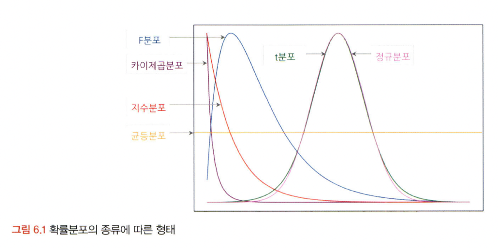
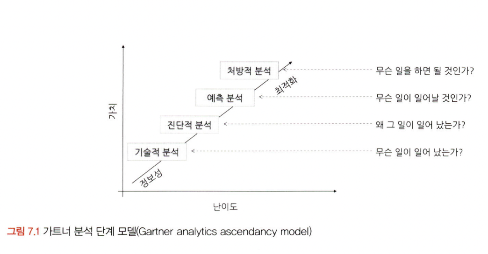
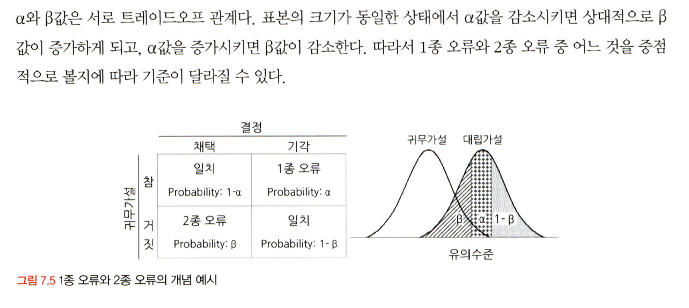

# 통계학 2주차 정규과제

📌통계학 정규과제는 매주 정해진 분량의 『*데이터 분석가가 반드시 알아야 할 모든 것*』 을 읽고 학습하는 것입니다. 이번 주는 아래의 **Statistics_2nd_TIL**에 나열된 분량을 읽고 `학습 목표`에 맞게 공부하시면 됩니다.

아래의 문제를 풀어보며 학습 내용을 점검하세요. 문제를 해결하는 과정에서 개념을 스스로 정리하고, 필요한 경우 추가자료와 교재를 다시 참고하여 보완하는 것이 좋습니다.

2주차는 `1부. 데이터 기초체력 기르기`를 읽고 새롭게 배운 내용을 정리해주시면 됩니다.


## Statistics_2nd_TIL

### 1부. 데이터 기초체력 기르기
### 06. 확률분포
### 07. 가설검정

## Study Schedule

|주차 | 공부 범위     | 완료 여부 |
|----|----------------|----------|
|1주차| 1부 p.2~56     | ✅      |
|2주차| 1부 p.57~79    | ✅      | 
|3주차| 2부 p.82~120   | 🍽️      | 
|4주차| 2부 p.121~202  | 🍽️      | 
|5주차| 2부 p.203~254  | 🍽️      | 
|6주차| 3부 p.300~356  | 🍽️      | 
|7주차| 3부 p.357~615  | 🍽️      |

<!-- 여기까진 그대로 둬 주세요-->

# 06. 확률분포

```
✅ 학습 목표 :
* 이산확률분포의 종류와 특징을 설명할 수 있다.
* 연속확률분포의 종류와 특징을 설명할 수 있다. 
* 중심극한정리(CLT)의 개념을 이해하고 설명 할 수 있다.
```
* 이산확률분포 (확률질량함수)
    * 정의: 특정 값의 사건이 발생할 확률의 크기 
        * 확률질량(mass)함수란, 확률들이 점에 쌓이듯 존재하기에 질량(mass)이라는 단어를 씀
    * 특징: 특정 값을 가질 확률 계산 가능
    * 분포: 이항 분포, 초기하 분포, 포아송 분포 

 * 연속확률분포 (확률밀도함수)
    * 정의: 특정 구간에서 사건이 발생할 확률의 크기
    * 특징: 특정 값을 가질 확률 계산 X
        * 연속적인 공간에서 확률변수가 가질 수 있는 값이 무한히 많기 때문에, 특정값을 가질 확률이 0으로 수렴하게 됨
        * 분포: 정규(Z) 분포, t분포, 카이제곱분포, F분포, 지수분포




## 6.2. 이산확률분포    
* 균등분포
    * 결과를 X라고 할 때, X가 동일한 확률
* 이항분포
    * 복원추출: 각각의 결과값이 독립적으로 실행됨
    * 두 확률의 합은 항상 1
* 초기하분포
    * 비복원추출: 각각의 결과값이 독립적으로 실행되지 않음
* 포아송분포
    * 일정 관측 공간에서 특정 사건이 발생하는 횟수
    * 이항 및 초기하 분포는 총 시행 횟수에 따른 성공과 실패 횟수를 나타내지만, 포아송분포는 일정 시공간에서 나타나는 사건의 횟수


## 6.3. 연속확률분포
* 정규분포
    * 좌우 대칭 종 모양
    * 평균 = 최빈값 = 중앙값
    * 표준화: 다른 정규분포 간 용이한 비교를 위해 형태 통일
* 지수분포
    * 특정 사건이 발생한 시점부터 다음 사건이 발생할 때까지의 시간을 확률변수값으로 가짐
        * ex. 지하철역 대기 시간
    * 포아송 분포의 확률변수 = 사건 발생 횟수, 지수분포의 확률변수는 시간
    * 지수분포의 소요시간 평균 = 람다의 역수


## 6.4. 중심극한정리
* 정의: 데이터의 크기가(n)이 일정한 양(30)이 넘으면 평균의 분포는 정규분포에 근사하다는 이론
    * 표본을 여러 번 추출 시 '각 표본'의 평균들의 분포가 정규분포를 이룬다는 뜻
    * 표본의 크기가 클수록 각 표본은 모집단과 유사하기 때문에, 표본의 평균이 비슷하여 평균들 차이가 없음. 그러므로, 표본 평균의 분포는 뾰족한 모양을 띄게 된다. 
* 특징: 그렇기에, 크기가 클수록 표본 평균의 분포는 중심 극한 정리로 인해 정규 분포에 가까워진다. 
* 활용: 모집단의 분포를 모르더라도 표본을 충분히 추출하면 표본 평균들의 분포가 정규분포를 이루기에 통계적 추정이 가능해진다. 
    * ex. 표본의 평균이 87이면 (표본의 크기가 충분히 확보되었을 때) 모수의 실제 평균이 87 +- 1시그마일 확률은 68% 

# 07. 가설검정

```
✅ 학습 목표 :
* 귀무가설과 대립가설의 개념을 정의하고, 주어진 연구 질문에 적절한 가설을 설정할 수 있다.
* 가설검정의 유의수준과 p값의 개념을 설명하고, p값을 해석하여 귀무가설을 기각할지 여부를 판단할 수 있다.
* 1종 오류와 2종 오류의 차이를 설명하고, 실제 사례에서 어떤 오류를 더 중요하게 고려해야 하는지 판별할 수 있다.
```
## 7.1. 귀무가설과 대립가설
* 가설: 둘 혹은 그 이상의 변수들 간 관계에 대한 잠정적 결론
    * 귀무가설
    * 대립가설
        * 일반적으로 대립가설의 타당성을 증명하는 것보다 귀무가설의 비약성을 증명하는 것이 더 쉽다. 
    * 기술적 분석 제외, 모든 분석에 가설이 필요하다. 



## 7.2. 가설검정의 절차
* 절차: 가설검정 > 유의수준 설정 > 실험 수행 > 검정통계량 산출 > 대립가설 채택 / 기각
    * 유의수준
        * 보통 p-value < 0.05 시 대립가설 기각 
    * 실험 수행 시
        * 집단 간 평균 차이 검정: t-test, ANOVA
        * 종속변수에 대한 독립변수의 영향력 검정: 회귀모델 등

## 7.3. 가설검정의 유의수준과 p값
* 표본의 크기: 표본 통계량을 사용하기에 표본의 크기에 따라 귀무가설을 채택할 수도, 귀각할 수도 있다. 
* 유의수준: 통계적 검정에서 잘못된 결론을 내릴 확률을 의미하며, 기각 기준을 결정한다 
    * 즉, 1종 오류와 같으며 p-value와 비교하기 전, 우리가 잘못 기각할 확률을 설정해두는 것이다. 
* p-value: 관측된 데이터가 귀무가설 하에서 발생할 확률
    * 즉, 귀무가설을 기각할 최소한의 확률로, 확률이 작을수록 귀무가설 밖에서 발생할 확률이 높다는 것.
* 유의수준과 p-value:
    * 유의수준 > p-value: 귀무가설 기각
    * 유의수준 < p-value: 귀무가설 채택 
    * 즉, 연구자가 설정한 허용 오차 내에서 결과가 통계적으로 유의미하다고 판단
* 유의수준 = 1 - 신뢰수준
* 양측 검정 및 단측 검정:
    * 양측 검정: 정규분포를 이룰 때 유의수준 2로 나눈 기준점으로 귀무가설 채택/기각 (=)
    * 단측 검정: 정규분포가 아닐 때, 한쪽 꼬리에 배분한 유의수준을 기준점으로 귀무가설 채택/기각 (><>)

## 7.4. 1종 오류와 2종 오류
* 1종 오류(알파): 귀무가설이 참인데, 귀무가설 기각
    * 즉, 효과 없는데 있대
    * 오류 줄이기: 유의수준 낮추기
        * 유의수준이 낮아질수록 1종 오류 범할 확률이 줄어듦. 그럼에도 p-value가 극단적으로 낮다면, 1종 오류를 감안하고도 결과가 통계적으로 유의미하다고 판단하는 것.
    * 단순 vs 복잡: 단순한 귀무가설에서 유의수준이 1종 오류가 일어날 확률이지만, 복잡한 귀무가설에서 유의수준은 1종 오류가 발생할 확률의 최대치
        * 복잡한 귀무가설에서는 여러 값이 포함되기 때문에 여러 가능한 값들에 대해 오류를 범할 확률의 최대치를 나타냄. 
* 2종 오류(베타): 귀무가설 거짓인데, 귀무가설 채택
    * 효과 있는데 없대
    * 오류 줄이기: 가설검정의 검정력 늘리기 
        * 검정력(1-베타): 귀무가설 거짓일 때 기각할 확률 (올바르게 유의미한 것 선별)
* 1종 오류와 2종 오류는 트레이드 오프 관계
    * 유의수준이 정해지면 검정력이 자동적으로 정해지기 때문
    * 표본 크기가 동일한 상태에서 알파 증가 시 베타 감소 



* [일치] 귀무가설 참, 채택 = 1 - 알파
* [1종 오류] 귀무가설 참, 기각 = 알파
* [2종 오류] 귀무가설 거짓, 채택 = 베타
* [일치] 귀무가설 거짓, 기각 = 1 - 베타

<br>
<br>

# 확인 문제

## 문제 1.

> **🧚Q. 다음 중 귀무가설(H₀)을 기각해야 하는 경우는 언제인가요? 정답을 고르고, 그 이유를 간단히 설명해주세요.**

> **1️⃣ 유의수준(α)이 0.05이고, p값이 0.03일 때   
2️⃣ 유의수준(α)이 0.01이고, p값이 0.02일 때**

```
1️⃣번: 유의수준(α)이 0.05이고, p값이 0.03일 때

유의수준 연구자가 설정한 오류 수준으로, 귀무가설을 기각하는 기준이 된다. 이때, p-value가 유의수준보다 작다면 현재의 결과가 우연히 발생할 확률이 낮기에 귀무가설을 기각할 수 있는 근거가 된다. 
```

### 🎉 수고하셨습니다.
