# 통계학 3주차 정규과제

📌통계학 정규과제는 매주 정해진 분량의 『*데이터 분석가가 반드시 알아야 할 모든 것*』 을 읽고 학습하는 것입니다. 이번 주는 아래의 **Statistics_3rd_TIL**에 나열된 분량을 읽고 `학습 목표`에 맞게 공부하시면 됩니다.

아래의 문제를 풀어보며 학습 내용을 점검하세요. 문제를 해결하는 과정에서 개념을 스스로 정리하고, 필요한 경우 추가자료와 교재를 다시 참고하여 보완하는 것이 좋습니다.

2주차는 `2부-데이터 분석 준비하기`를 읽고 새롭게 배운 내용을 정리해주시면 됩니다.


## Statistics_3rd_TIL

### 2부. 데이터 분석 준비하기
### 08. 분석 프로젝트 준비 및 기획
### 09. 분석 환경 세팅하기


## Study Schedule

|주차 | 공부 범위     | 완료 여부 |
|----|----------------|----------|
|1주차| 1부 p.2~56     | ✅      |
|2주차| 1부 p.57~79    | ✅      | 
|3주차| 2부 p.82~120   | ✅      | 
|4주차| 2부 p.121~202  | 🍽️      | 
|5주차| 2부 p.203~254  | 🍽️      | 
|6주차| 3부 p.300~356  | 🍽️      | 
|7주차| 3부 p.357~615  | 🍽️      |  

<!-- 여기까진 그대로 둬 주세요-->

# 08. 분석 프로젝트 준비 및 기획

```
✅ 학습 목표 :
* 데이터 분석 프로세스를 설명할 수 있다.
* 비즈니스 문제를 정의할 때 주의할 점을 설명할 수 있다.
* 외부 데이터를 수집하는 방법에 대해 인식한다.
```

## 8.1 데이터 분석의 전체 프로세스
### 8.1.1 데이터 분석의 3단계
    ⚠️ 데이터 분석의 목적: 효과적인 결정을 할 수 있도록 도움을 주는 것
* 데이터 분석의 프로세스
    * `1️⃣ 설계 단계` 분석에 들어가기 전 무엇을 하고자 하는지 명확하게 정의하고 프로젝트를 수행할 인력 구성
        * 과제 정의 및 범위 설정
        * 인력 구성 및 PM 확보
        * 실무자 및 분석가 간 협의 체계 수립

    * `2️⃣ 분석 및 모델링 단계` 데이터 분석 및 모델링을 위한 서버 환경 마련하고 본격적인 데이터 분석
        * 데이처 MART 구축
        * 준비, 가공, 분석 및 모델 도출
        * 모델 검증 및 실무, 경영진 협의
    * `3️⃣구축 및 활용 단계` 최종적으로 선정된 분석 모델을 업무에 적용 후 성과 측정 
        * 모델 적용 및 시스템 구축
        * 성과 평가 및 추가, 보완 프로젝트 검토

### 8.1.2 CRISP-DM 방법론
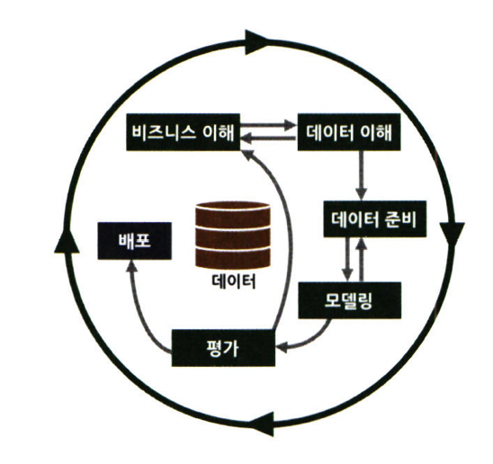
* `1단계 비즈니스 이해` 현재 상황 평가, 데이터 마이닝 목표 결정, 프로젝트 계획 수립
* `2단계 데이터 이해` 데이터 설명, 탐색, 품질 확인
* `3단계 데이터 준비` 데이터 선택, 정제, 필수 데이터 구성, 데이터 통합
* `4단계 모델링` 모델링 기법 선정, 테스트 디자인 생성, 모델 생성, 모델 평가
* `5단계 평가` 결과 평가, 프로세스 검토, 다음 단계 설정
* `6단계 배포` 배포 계획, 모니터링 및 유지 관리 계획, 최종 보고서 작성, 프로젝트 검토


### 8.1.3 SAS-SEMMA 방법론
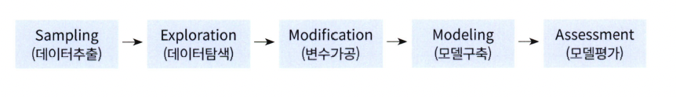
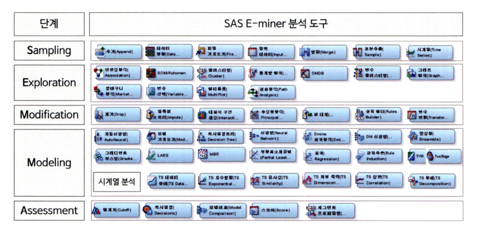
* `Sampling 단계` 데이터 추출, 데이터 분할 및 병합, 분석 데이터 생성, 분석 모델 생성을 위한 학습/검증/테스트 데이터셋 분할
* `Exploration 단계` 데이터 탐색, 변수 관계 파악, 변수 선정, 아이디어 도출 및 분석 방향 수정
* `Modification 단계` 결측값 처리 및 최종 분석 변수 선정, 데이터 가공, PCA 분석 등을 통한 새로운 변수 생성
* `Modeling 단계` 적합성 검토, 분석 모델 선택 후 분석 알고리즘 적용, 지도학습/비지도학습/강화학습 등 데이터 형태에 따라 알맞은 모델 선정, 모델 세부 옵션 설정
* `Àssessment 단계` 성능 비교/분석/평가, 임계치 설정, 비즈니스 인사이트에 적용, 추가적인 데이터 분석 진행

❗️ 전반적인 흐름은 CRISP-DM 방법론을 따르나, 세부적인 항목은 SAS-SEMMA 방법론을 참고하면 좋을 듯

## 8.2 비즈니스 문제 정의와 분석 목적 도출
    ⚠️ 현재의 문제를 명확히 정의하고, 그에 맞는 데이터 분석을 진행해야 함
    ⚠️ 목적없는 데이터 분석은 의미X 인사이트 도출로 이어질 수 있으며, 제대로된 효과를 보기 힘듦

* MECE 원칙: 세부 정의들이 겹치지 않고 전체를 이뤄야 함
    * 예시: 로직 트리를 이용한 세부 항목 설정 (추진 과제 - 세부과제1 - 세부과제2)

* 비즈니스 문제 정의: 현상(약정 기간이 끝난 고객들의 이탈)이 아닌 문제(수익 감소)를 이야기해야 함
    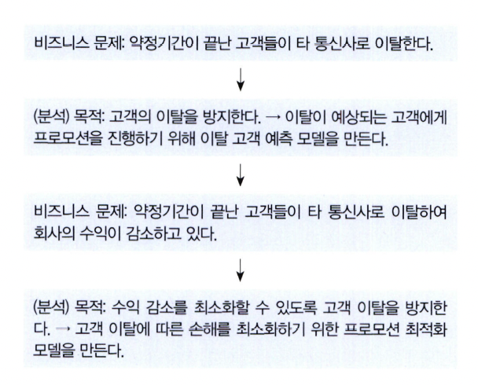


❗️ 앞으로 진행될 학술제, 공모전, 토이프로젝트 등에서 데이터셋을 대략적으로 파악 후 **문제 정의**를 잘 해야겠다는 생각


## 8.3 분석 목적의 전환
    ⚠️ 분석 프로젝트 방향은 언제든 바뀔 수 있다
    ⚠️ 변수 간 연관성을 찾을 수 없다면, 다른 변수를 찾아 연관성을 분석해보기

❗️ 어느 회사든 `커뮤니케이션`이 중요함. 분석가는 도메인 지식이 없으며, 실무진은 분석 능력이 없기 때문에 상호간 이해를 통한 협력이 중요.

## 8.4 도메인 지식
    ⚠️ 도메인 지식: 해당되는 분야의 업에 대한 이해도
    ⚠️ 직접 의미 있는 변수를 찾아내고 분석 방향을 설정하는 것도 도메인 지식이 충분히 수반되었을 때 가능

❗️ 관심없는 도메인이라도 논문 읽기, 구글링을 통해 실무자와 커뮤니케이션할 수 있는 방법 배우는게 중요할듯


## 8.5 외부 데이터 수집과 크롤링
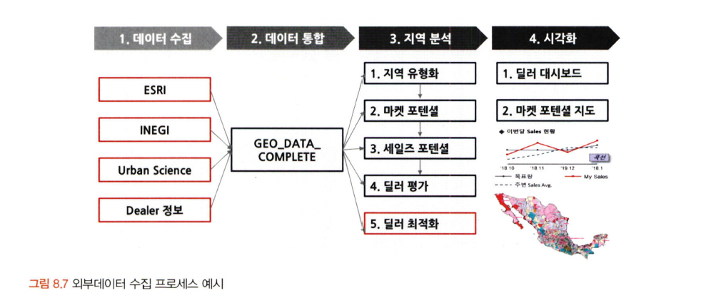

* 외부 데이터 수집 방법
    * `1️⃣ 데이터 구매`
    * `2️⃣ 오픈 데이터 수집`
    * `3️⃣ 크롤링`

* 크롤링 방법
    * `BeautifulSoup` or `Selenium` 라이브러리 이용
    * 크롬의 개발자 모드 클릭 후 소스코드 복사

❗️ 평소에 크롤링할 때 법적인 이슈를 생각 안했었는데 조심해야겠다는 생각. 특히, 실무에서는 더더욱 조심.


# 09. 분석 환경 세팅하기

```
✅ 학습 목표 :
* 데이터 분석의 전체적인 프로세스를 설명할 수 있다.
* 테이블 조인의 개념과 종류를 이해하고, 각 조인 방식의 차이를 구분하여 설명할 수 있다.
* ERD의 개념과 역할을 이해하고, 기본 구성 요소와 관계 유형을 설명할 수 있다.
```

## 9.1 어떤 데이터 분석 언어를 사용하는 것이 좋을까?
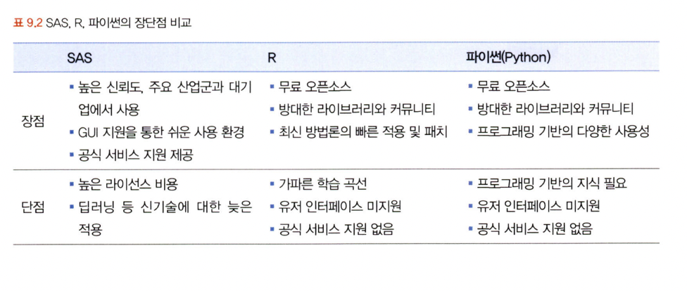


## 9.2 데이터 처리 프로세스 이해하기
    프로세스: OLTP ➡️ Data Warehouse ➡️ Data Mart ➡️ OLAP

* OLTP: 실시간으로 데이터를 트렌잭션 단위로 수집, 분류, 저장하는 시스템
* DW: 수집된 데이터를 사용자 관점에서 주제별로 통합하여 쉽게 원하는 데이터를 빼낼 수 있도록 저장한 통합 데이터베이스
    * 장점: OLTP를 보호하고 데이터 활용 효율 제고 
    * ODS: 데이터를 DW 전 임시 저장하는 곳 for 최신 데이터 반영
* DM: 사용자의 목적에 맞도록 가공된 일부의 데이터가 저장되는 곳 
    * 장점: DW 시스템 부하 감소 

- - - 

    프로세스 기본 개념: EXTRACT / TRANSFORM / LOAD

* EXTRACT: 데이터베이스로부터 필요한 데이터 읽음
* TRANSFORM: 미변환 상태의 raw 데이터를 정리, 필터링, 정형화하고 요약하여 분석에 적합한 상태롤 바꿈
* LOAD: 변환 데이터를 새로운 테이블에 적재


## 9.3 분산데이터 처리
* 정의: 한 컴퓨터가 처리해야 할 일을 여러 컴퓨터가 나눠서 한 다음 결과를 합치는 것
    * scale-up: 하나의 컴퓨터 용량 늘리고 더 빠른 프로세서 탑재
    * scale-out: 여러 대의 컴퓨터를 병렬 연결
        * 효율이 더 높음

### 9.3.1 데이터 분산시스템 HDFS
> HDFS
* 정의: 병렬 연결된 컴퓨터들의 효율적 처리를 돕기 위한 시스템
* 모듈
    * 슬레이브 노드: 데이터 저장 및 계산
    * 마스터 노드: 대량의 데이터를 HDFS에 저장하고 맵리듀스 방식을 통해 데이터 병렬 처리
    * 클라이언트 노드: 맵리듀스 작업을 통해 산출된 결과를 사용자에게 보여줌

> 1️⃣ 맵리듀스 
 * 맵 단계: 흩어진 데이터를 관련 데이터끼리 묶어 임시의 집합 형성
    * ⭐️ 특징: key-value 쌍으로 데이터 처리 (레코드와 유사)
* 리듀스 단계: 필터링과 정렬을 거쳐 데이터 추출 
 * 예시:
 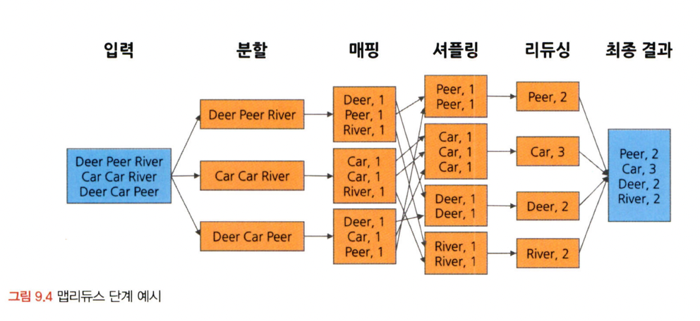
    * 분할: 고정된 크기의 조각으로 분할
    * 매핑: key-value, 단어 개수
    * 셔플링: countiing 결과를 정렬 및 병합
    * 리듀싱: 각 결과값 취합하여 최종 결과값 산출 

> 2️⃣ 하둡
* 하둡 1.0: HDFS와 맵리듀스
* 하둡 2.0: 리소스 관리자인 YARN 추가
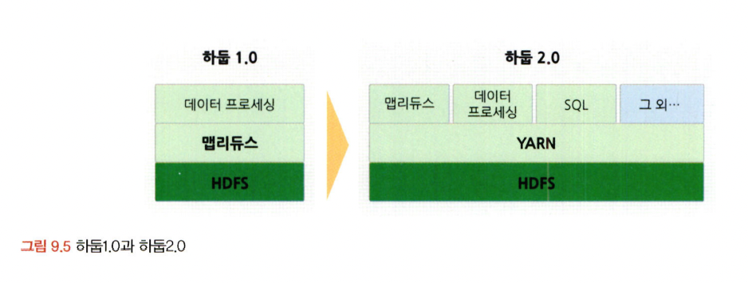


> 분산시스템 구조
* 물리적 구성(=하드웨어)
    * 노드 = 컴퓨터 > 몇 개의 컴퓨터 = 렉 > 하둡 클러스터
* 시스템적 구성(=소프트웨어)
    * 하나의 클라이언트 > 잡 실행 > 여러 개의 테스크 실행 > 여러 개의 맵과 리듀싱

### 9.3.2 야파치 스파크
> HDFS와 스파크
* HDFS의 구성
    * 운영 관리
    * 📍 분산 데이터 처리 (ex. 스파크)
    * 분산 파일 시스템
    * 데이터 전송 
* 스파크 장점
    * 메모리 저장하여 재사용 가능
    * 머신러닝같이 반복형 대화형 테스크에 뛰어남 
* 스파크 특징 
    * 인 메모리 기반 빠른 데이터 처리
    * 다양한 언어 지원


## 9.4 테이블 조인과 정의서 그리고 ERD
### 9.4.1 테이블 조인
> 레프트 조인과 라이트 조인

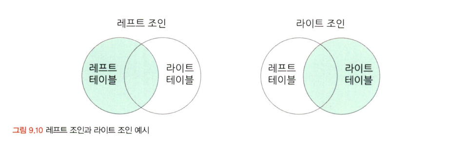
* 정의: 기준 테이블 유지 + 조인 테이블의 데이터 추가
* 특징
    * 일치하는 키가 없는 행은 조인 테이블의 데이터가 NULL로 나타남
    * 조인 테이블의 데이터가 여러 개이면 조인 시 행이 늘어나게 됨

> 이너 조인과 풀 조인

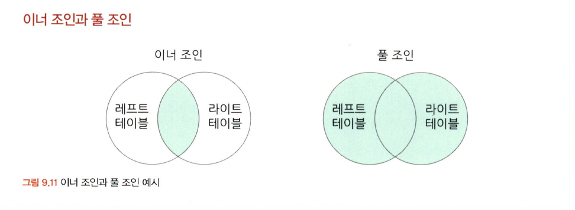
* 이너 조인 정의: 두 테이블 간 겹치는 부분의 행만 가져옴 (결측값 X)
* 풀 조인 정의: 모든 행을 살림 (결측값 O)

> 크로스 조인

* 정의: 한 테이블의 레코드별로 다른 테이블 값을 추가할 때
* 특징: 머신러닝에서 주로 사용


### 9.4.2 데이터 단어사전
* 정의: 각 칼럼과 테이블의 이름을 정할 때 체계를 약속한 일종의 사전
* 메타데이터 관리 시스템: 데이터가 어디에 저장되어 있는지, 어떻게 사용할 것인지 이해할 수 있도록 데이터에 대한 정보 관리하는 시스템

### 9.4.3 테이블 정의서
* 정의: 메타데이터 관리 시스템의 간소화 버전으로, DW/DM에 적재된 테이블과 칼럼의 한글, 영문명, 데이터 속성 그리고 간단한 설명 저장

### 9.4.4 ERD

    ⚠️ 테이블 간 일대일 매칭 혹은 다대다 매칭이 가능하기에, 테이블 간 관계를 정확히 파악 후 데이터를 다뤄야 함


* 정의: 각 테이블의 구성 정보와 테이블 간 관계를 도식으로 표현한 그림 형태
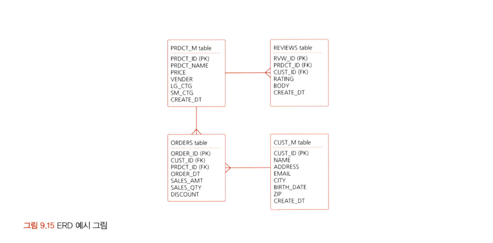
* 구분
    * 물리 ERD: DM를 효율적이고 결점없이 구현
    * 논리 ERD: 테이블 간 매핑에 오류X
* 식별자
    * 기본 키: 테이블에서 유일하게 구분되는 칼럼 (중복X.결측값X)
    * 외래 키: 참조 칼럼 (중복O.결측값O)
    * 슈퍼 키: 각 행을 유일하게 식별 가능한 하나의 키 혹은 조합된 키
        * ❗️ 슈퍼키에서 최소한의 속성(불필요한 컬럼X)을 가진 것이 기본 키
    * 후보 키: 유일성과 최소성 만족 but 기본키 X


<br>

<br>

# 확인 문제

## 문제 1.

> **🧚 아래의 테이블을 조인한 결과를 출력하였습니다. 어떤 조인 방식을 사용했는지 맞춰보세요.**

> 사용한 테이블은 다음과 같습니다.

|
---|---|

> 보기: INNER, LEFT, RIGHT 조인

<!-- 테이블 조인의 종류를 이해하였는지 확인하기 위한 문제입니다. 각 테이블이 어떤 조인 방식을 이용하였을지 고민해보고 각 테이블 아래에 답을 작성해주세요.-->

### 1-1. 

```
LEFT 조인: 오른쪽 테이블 값 중 부서 코드 50, 법무팀, 인천에 위치한 행이 조인되지 않았다. 이를 통해, 왼쪽 테이블 값을 기준으로 오른쪽 테이블 값이 추가되었음을 알 수 있다.
```

### 1-2. 

```
INNER 조인: 결측값이 없이 조인 되었기에 보기 3개중 INNER 조인으로 결합된 것을 알 수 있다.
```

### 1-3. 

```
RIGHT 조인: 왼쪽 테이블 값 중 부서코드가 50을 가진 행이 없기에, 조인 시 해당 행값이 결측값 처리가 되었다. 이를 통해, 오른쪽 테이블 값을 기준으로 왼쪽 테이블 값이 추가되었음을 알 수 있다.
```

### 🎉 수고하셨습니다.
