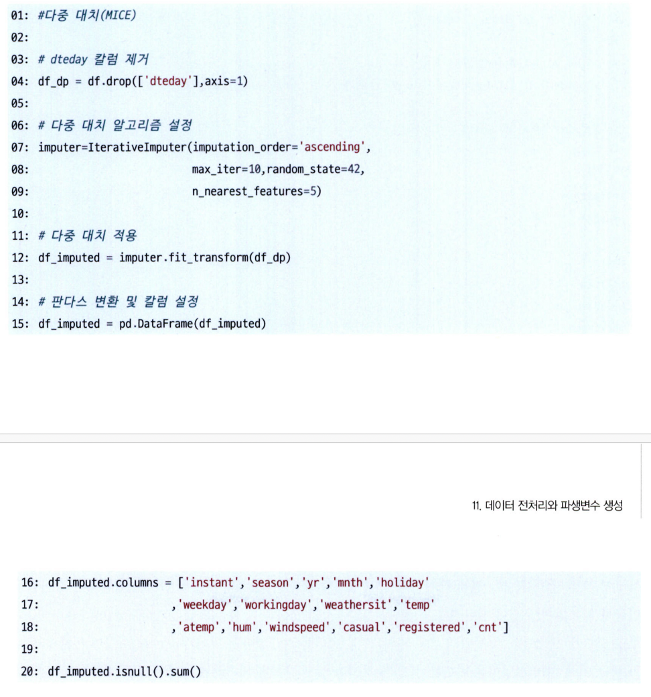

# 통계학 5주차 정규과제

📌통계학 정규과제는 매주 정해진 분량의 『*데이터 분석가가 반드시 알아야 할 모든 것*』 을 읽고 학습하는 것입니다. 이번 주는 아래의 **Statistics_5th_TIL**에 나열된 분량을 읽고 `학습 목표`에 맞게 공부하시면 됩니다.

아래의 문제를 풀어보며 학습 내용을 점검하세요. 문제를 해결하는 과정에서 개념을 스스로 정리하고, 필요한 경우 추가자료와 교재를 다시 참고하여 보완하는 것이 좋습니다.

5주차는 `2부. 데이터 분석 준비하기`를 읽고 새롭게 배운 내용을 정리해주시면 됩니다.


## Statistics_5th_TIL

### 2부. 데이터 분석 준비하기
### 11.데이터 전처리와 파생변수 생성


## Study Schedule

|주차 | 공부 범위     | 완료 여부 |
|----|----------------|----------|
|1주차| 1부 p.2~56     | ✅      |
|2주차| 1부 p.57~79    | ✅      | 
|3주차| 2부 p.82~120   | ✅      | 
|4주차| 2부 p.121~202  | ✅      | 
|5주차| 2부 p.203~254  | ✅      | 
|6주차| 3부 p.300~356  | 🍽️      | 
|7주차| 3부 p.357~615  | 🍽️      | 

<!-- 여기까진 그대로 둬 주세요-->

# 11.데이터 전처리와 파생변수 생성

```
✅ 학습 목표 :
* 결측값과 이상치를 식별하고 적절한 방법으로 처리할 수 있다.
* 데이터 변환과 가공 기법을 학습하고 활용할 수 있다.
* 모델 성능 향상을 위한 파생 변수를 생성하고 활용할 수 있다.
```


## 11.1. 결측값 처리

    ⚠️ 결측값 처리 방법 결정 전 EDA를 통해 결측값 비율, 한 변수에 결측값 몰려 있지 않은지 확인해야 함

> 특성 및 처리 방법
* 발생 특성
    * `완전 무작위 결측`: 결측값이 무작위로 발생
        * 어떤 값이 결측인지 아닌지는 다른 변수나 해당 변수 자체와 전혀 관련 없음
        * 결측값 포함 데이터 제거해도 편향 발생X (결과가 왜곡되지 않음)
        * 예시: 설문지에 실수로 아무 질문이나 한두 개를 안 쓴 경우
    * `무작위 결측`: 다른 변수의 특성에 의해 해당 변수 결측치가 체계적으로 발생
        * 예시: A마트 전국 매출 정보 중, 특정 체인점 POS 기기에 오류날 때 결측값은 해당 체인점 여부에 따른 특성에 영향 받음
    * `비무작위 결측`: 결측값들이 해당 변수의 특성 자체를 가짐
        * 예시: A마트 고객 정보 데이터에서 '고객 소득' 변수는 소득이 적어 공개하기를 꺼려함
        * 구분이 어려움 -> 결과값을 모르니까 왜 결측되었는지 이유를 알지 못함

* 처리 방법
    * `표본 제거 방법`: 전체 데이터에서 결측치 비율 10% 미만일 때 사용
        * 결측값 많은 변수 제거
        * 결측값 포함 행 제거
    * `평균 대치법`: 결측값 제외 값들의 평균 대치 
        * 장점: 표본 제거 방법 단점 보완
        * 단점: p-value 부정확
        * 완전 무작위 결측이 아닌 경우 잘 사용하지 않음 
    * `보간법`: 데이터가 시계열적 특성 가질 때 사용. 선형적 수치값 계산
    * `회귀대치법`: 해당 변수와 다른 변수 관계성 고려
        * 추정 결측값 변수를 종속변수, 나머지 변수를 독립변수로 설정
        * 장점: 독립변수의 조건부 평균 대치로 더 발전된 방법
        * 단점: 변수 분산 과소 추정
    * `확률적 회귀대치법`: 회귀식에 확률 오차항 추가
        * 장점: 변동성 조정
        * 단점: 표본오차 과소추정
    * `다중 대치법`: 단순대치를 여러 번 수행하여 n개의 가상적 데이터 생성하여 이들의 평균으로 결측값 대치 
        * 대치 단계
        * 분석 단계
        * 결합 단계 
        
    

> 실습

```
import missingno as msno 
msno.matrix(df)
plt.show()
````




## 11.2. 이상치 처리
> 정의, 목적 및 처리 방법
* 정의: 일부 관측치 값이 데이터 범위에서 크게 벗어난 아주 작거나 극단적인 값을 갖는 것
    * 평균(중위수)로부터 +-n 표준편차 이상 떨어져 있는 값 
    * 중위수 혹은 중위수 절대 편차 (MAD) 사용하는 것이 효과적
* 처리 목적: 분산 과도하게 증가시켜 모델링 정확도 감소 방지
* 처리 방법
    * `이상치 제거`
    * `관측값 변경`: 상한 or 하한값 중 가까운 값으로 선택
    * `가중치 조정`: 이상치 영향 감소 가중치 설정
    * 무조건적인 제거보다 맥락과 상황, 혹은 도메인 특성 생각해야 함

> 실습


## 11.3. 변수 구간화
> 정의 및 특징 
* 정의: 데이터 분석 능력 향상 or 해석 편리성을 위해 이산형 범수를 범주형 변수로 변환
* 구간화
    * 특정 의미 기준
    * 관측수 유사 기준
* 평활화: 단순한 이산값 변환 
* 효과적 구간화 측정 지표
    * WOE (Weight of Evidence)
    * IV(Information Value) 변수의 종속변수 설명력이 높을수록 구간화가 잘되면 IV 값도 높아짐
        * 0.3이상은 strong

> 실습

```
# qcut() 함수 사용하여 자동 구간화 (관측치 수 유사)
df1.insert(4, 'BMI_bin3', 0)  # 구간화용 빈 칼럼 생성

* df1.insert(): DataFrame의 특정 위치(열 인덱스)에 새로운 열을 삽입하는 함수
* 4: 새 열을 5번째 위치(인덱스 4)에 삽입하라는 뜻
* 'BMI_bin3': 새로 삽입할 열의 이름 (여기서는 BMI 값을 구간화한 결과를 저장할 용도)
```

* 종속변수에 대한 독립변수의 예측력을 통해 범위 기준 산출
* 이때, 종속변수는 가변수 처리


## 11.4. 데이터 표준화와 정규화 스케일링
> 목적 및 특징
* 목적: 독립 변수들의 단위가 다르거나 편차 심할 때 값의 스케일을 일정 수준으로 변환
    * 특히, 군집 분석에서 필수적 (변수, 차원마다 스케일이 다르면 안됨)
* 표준화: 각 관측치 값이 전체 평균 기준 어느 정도 떨어져 있는지 나타냄 (=z-score)
    * 서로 다른 변수 간 값의 크기 비교 가능
    * 데이터 평균 및 분산 기반 정규화하고 싶을 때
* 정규화: 데이터 범위를 0~1 변환하여 분포 조정
    * 전체 데이터 중 해당 값이 어떤 위치에 있는 지 파악 
    * 평균으로부터 얼마나 떨어져있는지는 모름 (minmax를 사용하기에)
* robustscaler
    * 이상치 민감성 보완
    * 데이터 중앙값(Q2)을 0으로 잡고, Q1과 Q3의 IQR 차이를 1이 되도록 

> 실습

* standardscaler() 함수 사용: ndarray 형태로 변환되기에 꼭 pd.dataframe으로 변환해주기


* 데이터 표준화시, 데이터 분포는 비슷하나 데이터 범위가 달라지는 것을 알 수 있음

## 11.5. 모델 성능 향상을 위한 파생 변수 생성
> 정의 
* 파생변수 정의: 원래 있던 변수 조합 or 함수 적용하여 새로 만들어낸 변수
    * 시점 대비 변화, 변환 (로그, 구간화, 스케일링, 이상치 여부)도 일종의 파생변수
    
* 사용방법: 분석 효율을 높이는 것이 목적이기에 데이터 파악 + 도메인에 대한 이해를 바탕으로 만들면 도움받을 수 있음
* 주의: 다중공선성 발생 가능성 높음. 변수 만든 후에 상관성 확인 필수

> 실습
* 로그 변환: log(x+1)	분포 정규화, 이상치 억제, 비율 데이터에 적합
* 제곱근 변환	sqrt(x+1)	중간 정도의 왜도 완화, 부드러운 스케일 감소
* 제곱 변환	x^2	작은 수 강조, 좌측 치우친(negative skew) 보정


<br>
<br>

# 확인 문제

## 문제 1. 데이터 전처리

> **🧚 한 금융회사의 대출 데이터에서 `소득` 변수에 결측치가 포함되어 있다. 다음 중 가장 적절한 결측치 처리 방법은 무엇인가?**

> **[보기]   
1️⃣ 결측값이 포함된 행을 모두 제거한다.  
2️⃣ 결측값을 `소득` 변수의 평균값으로 대체한다.  
3️⃣ `연령`과 `직업군`을 독립변수로 사용하여 회귀 모델을 만들어 `소득` 값을 예측한다.  
4️⃣ 결측값을 보간법을 이용해 채운다.**

> **[데이터 특징]**     
    - `소득` 변수는 연속형 변수이다.  
    - 소득과 `연령`, `직업군` 간에 강한 상관관계가 있다.  
    - 데이터셋에서 `소득` 변수의 결측 비율은 15%이다.

```
3️⃣번: 결측 비율이 15%이기에 결측값 포함 행을 함부로 제거할 수 없음. 연속형 변수이나 시계열 특성을 가지지 않기에 보간법을 사용할 수도 없음. 또한, `소득`변수가 `연령`과 `직업군`과의 상관관계가 있기에 평균값보다는 회귀 모델을 만들어 '소득'값을 예측해야 함.
```

## 문제 2. 데이터 스케일링

> **🧚 머신러닝 모델을 학습하는 과정에서, `연봉(단위: 원)`과 `근속연수(단위: 년)`를 동시에 독립변수로 사용해야 합니다. 연봉과 근속연수를 같은 스케일로 맞추기 위해 어떤 스케일링 기법을 적용하는 것이 더 적절한가요?**

<!--표준화와 정규화의 차이점에 대해 고민해보세요.-->

```
표준화를 이용하는 것이 적절하다.
표준화는 평균과 표준편차를 이용하고, 정규화는 최소최대값을 이용한다. `연봉`은 값이 크고 이상치가 있을 가능성이 높으며, `근속연수`는 이상치보다는 값의 범위가 작다는 것이 문제이다. 그렇기에, 최소최대값을 이용하는 정규화보다 평균과 표준편차를 이용하는 표준화가 스케일링에 더 적절할 것으로 판단된다.
```

### 🎉 수고하셨습니다.