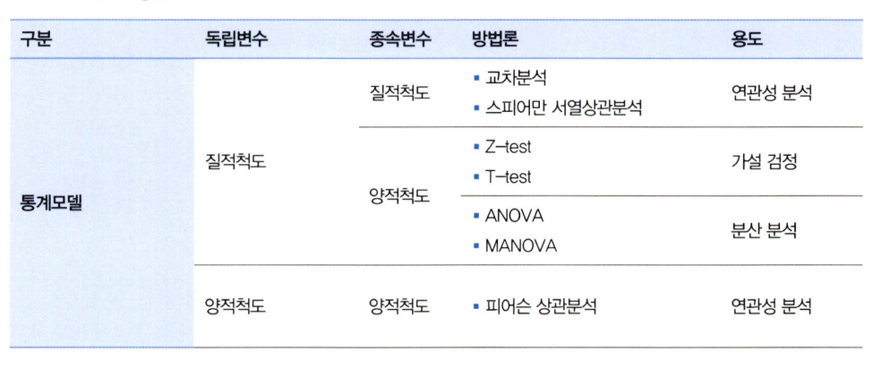
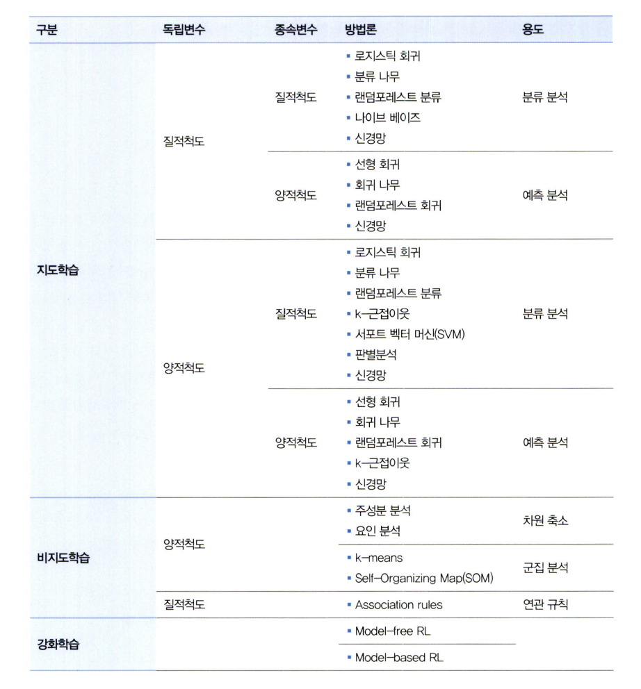
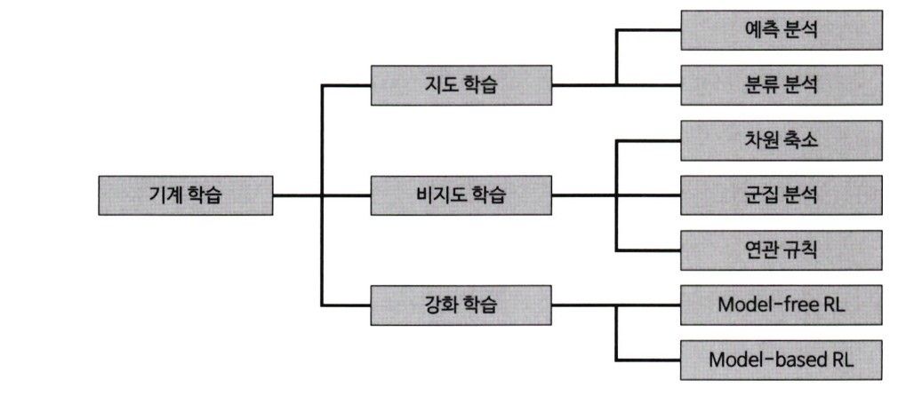
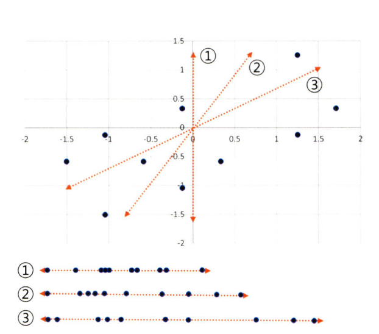
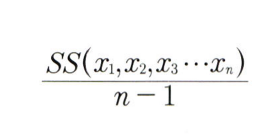
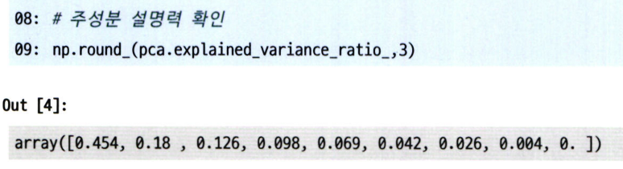
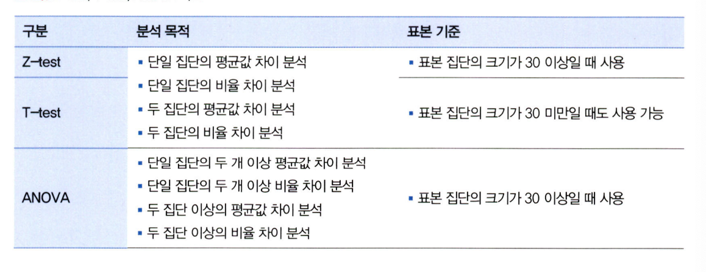
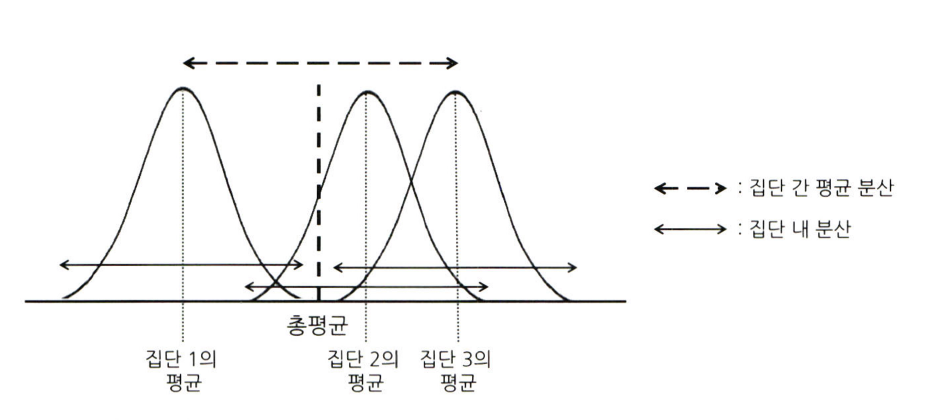

# 통계학 6주차 정규과제

📌통계학 정규과제는 매주 정해진 분량의 『*데이터 분석가가 반드시 알아야 할 모든 것*』 을 읽고 학습하는 것입니다. 이번 주는 아래의 **Statistics_6th_TIL**에 나열된 분량을 읽고 `학습 목표`에 맞게 공부하시면 됩니다.

아래의 문제를 풀어보며 학습 내용을 점검하세요. 문제를 해결하는 과정에서 개념을 스스로 정리하고, 필요한 경우 추가자료와 교재를 다시 참고하여 보완하는 것이 좋습니다.

6주차는 `3부. 데이터 분석하기`를 읽고 새롭게 배운 내용을 정리해주시면 됩니다.


## Statistics_6th_TIL

### 3부. 데이터 분석하기
### 12.통계 기반 분석 방법론


## Study Schedule

|주차 | 공부 범위     | 완료 여부 |
|----|----------------|----------|
|1주차| 1부 p.2~56     | ✅      |
|2주차| 1부 p.57~79    | ✅      | 
|3주차| 2부 p.82~120   | ✅      | 
|4주차| 2부 p.121~202  | ✅      | 
|5주차| 2부 p.203~254  | ✅      | 
|6주차| 3부 p.300~356  | ✅      | 
|7주차| 3부 p.357~615  | 🍽️      |

<!-- 여기까진 그대로 둬 주세요-->

# 12.통계 기반 분석 방법론

```
✅ 학습 목표 :
* 주성분 분석(PCA)의 개념을 설명할 수 있다.
* 다중공선성을 진단할 수 있다.
* Z-TEST와 T-TEST의 개념을 비교하고, 적절한 상황에서 검정을 설계하고 수행할 수 있다.
* ANOVA TEST를 활용하여 세 개 이상의 그룹 간 평균 차이를 검정하고, 사후검정을 수행할 수 있다.
* 카이제곱 검정을 통해 범주형 변수 간의 독립성과 연관성을 분석하는 방법을 설명할 수 있다.
```

## 12.1. 분석 모델 개요
* 데이터 분석 방법론
    * 통계 모델: `모형과 해석`을 중요하게 생각
    * 기계 학습: 대용량 데이터를 활용하여 `예측의 정확도` 제고

* 통계 모델 방법론 

    ```Ruby
    1) 독립변수가 질적 척도 일 때
    1-1) 종속변수가 질적 척도 일 때
    `연관성 분석`을 위해 교차분석과 스피어만 서열상관분석 이용 

    1-2) 종속변수가 양적 척도 일 때 
    `가설 검정`을 위해 Z-test/T-test 혹은 ANOVA/MANOVA 이용 

    2) 독립변수가 양적 척도 일 때
    종속변수가 양적척도이므로 `연관성 분석`을 위해 피어슨 상관분석을 이용
    ```

* 기계 학습 방법론 
    * 방법 1) 종속 변수의 유무
        * `지도 학습`: 종속변수 O, 입력값에 대한 정답이 주어져 결과, 정답 사이 오차를 줄이기 위해 학습과 모델 수정 반복
        * `비지도 학습`: 종속변수 X, 정답없이 변수 패턴 파악 데이터를 군집화하는 방법 
        * `강화 학습`: 시행착오를 통해 학습하는 과정을 기본 콘셉트로 한 방법. 모델 결과에 보상과 벌을 주면서 스스로 학습하게 하는 것. 
            * ex.ChatGPT
    
    * 방법 2) 변수 형태
        * 양적
        * 질적 


    
    


    ```Ruby
    1) 지도학습의 독립변수가 질적 척도 일 때 
    1-1) 종속변수가 질적 척도일 때
    `분류 분석`을 위해 로지스틱 회귀, 분류 나무, 랜덤 포레스트 분류, 나이브 베이즈, 신경망 사용 

    1-2) 종속변수가 양적 척도일 때
    `예측 분석`을 위해 선형 회귀, 회귀 나무, 랜덤 포레스트 회귀, 신경망 사용 

    2) 지도학습의 독립변수가 양적 척도 일 때
    2-1) 종속변수가 질적 척도일 때
    `분류 분석`을 위해 로지스틱 회귀, 분류 나무, 랜덤 포레스트 분류, k-근접 이웃, 서포트 벡터 머신, 판별 분석, 신경망 사용 

    2-2) 종속변수가 양적 척도일 때
    `예측 분석`을 위해 선형 회귀, 회귀 나무, 랜덤 포레스트 회귀, k-근접 이웃, 신경망 사용 

    3-1) 비지도학습의 독립변수가 양적 척도 일 때 
    `차원 축소`를 위해 주성분 분석, 요인 분석 이용
    `군집 분석`을 위해 k-means, SOM 이용

    3-2) 비지도학습의 독립변수가 질적 척도 일 때 
    `연관 규칙`을 위해 Association rules 사용

    4) 강화 학습일 때 
    Model-free RL or Model-based RL 사용
    ```

## 12.2. 주성분 분석(PCA)
> 주성분 분석
* 정의: 여러 개의 독립변수들을 잘 설명해줄 수 있는 주된 변수를 추출
* 전제: 변수들이 `등간 척도`나 비율척도로 측정된 `양적 변수`여야 하며, 관측치들이 독립적이고 정규분포를 이뤄야 한다.
* 방법
    1) 변수 선택을 통해 비교적 불필요하거나 유의성 낮은 변수 제거 
        * `PCA`로 변수 수 축약을 통한 정보 손실 최소화
    2) 변수들의 잠재적 성분 추출하여 차원 축소
        * `CFA`로 변수 차원 규명하며 변수들간 구조 파악

> PCA
* 목적: 데이터 점들의 분산을 최대한 보존하는 축을 통해 차원 축소
* ⚠️ 주성분 변수: `전체 변수를 통합적으로 잘 설명해주는` 변수 
* 원리: 데이터 분산을 잘 표현하는 저차원 찾기


> PCA 자세히 이해하기
    > ⚠️분산으로 이해하면 편함

* `주성분축`: (0, 0) 원점에서부터 각 점으로 직각으로 내려 그린 거리(=정사영 거리)의 합이 가장 큰 방향
* `주성분 축과 수직거리`: 피타고라스 정리에 의해 최소화
* `제2주성분축`: 주성분축과 직교하는 선으로, 짧은 길이(낮은 분산)으로 생성됨
* `주성분의 설명력=분산`: 모든 포인트들과 주성분과의 거리의 제곱합 / n-1
    * 전체 분산 N = 각 주성분의 분산의 합


    
| 개념                     | 의미                                       | PCA에서의 역할           |
|--------------------------|--------------------------------------------|---------------------------|
| 주성분 축에 투영된 거리 | 데이터가 축 위에 얼마나 "펼쳐져 있는가"   | 👉 크게 (분산 최대)     |
| 주성분 축과의 수직 거리 | 축으로부터 벗어난 오차, 정보 손실         | 👉 작게 (오차 최소)     |

> 실습
* 주성분 분석 전 데이터 정규화해야 함 bc of 이상치
* 설명력 이해하기 



> PCA와 CFA
* `공통점`: 둘다 요인분석을 하기 위한 기법, 독립변수 설명할 주된 성분 추출
* `차이점`: PCA는 전체 분산을 토대로 / CFA는 공통 분산을 토대로
* `차이점2`: PCA는 변수 수 축약 / CFA는 변수 수 축약 + 상관성 높은 변수를 묶어 잠재 변수 찾음


## 12.4. 다중공선성 해결과 섀플리 밸류 분석
> 다중공선성 정의
* `정의`: 독립변수들간 상관관계가 높은 현상
* `왜 문제인가`: 두 변수가 설명하는 부분이 동일하기에 예측 성능이 과장되어 나옴 -> 모델 유의성 평가X
* `판별 기준`
    * (1) 상관분석
    * (2) 결정계수가 크지만 회귀계수에 대한 t값이 낮을 때 
        * 각 계수 추정치가 불안해 표준오차가 크다는 것
    * (3) VIF, 분산팽창계수로 판단
        * 해당 변수가 다른 변수들에 의해 설명될 수 있는 정도 
        * 크면 다른 변수들과 상관성이 높음 
        * 5이상이면 의심, 10이상이면 다중공선성 있다고 판단 
        * 루트VIF = 다중공선성 없는 상태보다 표준오차가 N배 높다는 뜻 
* `해결 방법`
    * (1) VIF 값 높은 변수 중 종속변수와의 상관성이 낮은 변수 제거
    * (2) 표본 관측치 추가 확보 
    * (3) **현실적** 로그 혹은 표준화/정규화로 변수 가공 
    * (4) **변수 해석 어려움** 주성분분석을 통한 변수 축약
    * (5) 변수 선택 알고리즘: 전진 선택, 후진제거, 단계적 선택 통해 모형 적합 변수 선정 

> 섀플리 밸류 분석 정의
* 정의: 독립변수가 종속변수의 설명력에 기여하는 순수 수치 계산
* 변수x1의 섀플리 밸류 계산: 모든 조합(단독, 두 변수, 세 변수, ~ n변수)에서 x1의 기여도 평균
* 총 섀플리 밸류 계산: 각 섀프리 밸류의 합


## 12.6. Z-test와 T-test
> Z-test와 T-test
* 목적: 단일 표본 집단의 평균 변화 분석 혹은 두 집단의 평균값 혹은 비율 차이 분석 
* 전제: 양적 변수, 정규분포, 등분산
    * 등분산O: equal variance t-test 수행
    * 등분산X: Welch's t-test tngod 
* 표본 30 이상
    * z-test, t-test
* 표본 30 미만
    * t-test



> 단일 집단 통계량 계산
* t통계량: | 표본 평균 - 모평균 | / 표본의 표준오차 
    * 표준오차값이 클수록 t통계량 작아짐 -> 유의성 낮아짐 
* z통계량: | 표본 평균 - 모평균 | / 모집단의 표준오차

> 단일 집단 통계 검정
* (1) ‼️ 산포도 시각화를 통해 분포 파악 ‼️
* (2) 단일 집단의 평균값 차이 분석
* (3) 귀무가설 채택 Or 기각

> 두 집단의 통계량 계산
* t 통계량: | A집단 평균 - B집단 평균 | - |A모집단 평균 - B모집단 평균 | / (A집단의 분산 / 표본 수 + B단의 분산 / 표본 수)의 제곱근
* 즉, 두 집단의 평균 간 차이를 표준오차로 나누는 것

> 단일 / 두 집단의 비율 차이에 대한 t-test
* 계산: 비율 차이를 표준오차로 나눠 t값 계산 
    * 표본 비율: p
    * 표본 비율의 분산: p(1-p)
    * 표본 비율의 표준오파: p(1-p)/n의 제곱근 

> 실습
* (1) describe()
* (2) 박스플롯 시각화
* (3) 정규성 검정
* (4) 등분산성 검정


## 12.7. ANOVA
> 정의
* 목적: 세 집단 이상의 평균 차이 검정
* F분포?: analysis of variance의 줄임말로 분산 분석이라고도 불림 
* 가설: H0=독립변수의 차이에 따른 종속변수는 동일하다
* 일원 분산분석: 요인이 하나일 때
* 전제: 독립변수는 범주형 변수, 종속변수는 연속형 변수 
    * 독립, 종속 모두 범주 -> 교차분석
    * 독립, 종속 모두 연속 -> 회귀분석

> 계산
* f통계량 = 집단 간 평균 분산(MS집단간) / 집단 내 분산(MS집단 내)

* 결과값으로 집단 간 평균이 모두 다른 것인지 일부만 다른 것인지 알 수 없음. 1종 오류 방지를 위해 사후 검증해야 함
* ‼️ 사후검증: turkey의 HSD /scheffe 등 유의수준안의 부집단 구별

> 실습
* 사후검증 때: true값이 return 된 두 집단 관계 -> 유의미한 차이 존재

## 12.8. 카이제곱 검정(교차분석)
> 정의
* 목적: 교차분석 중 하나, 명목 혹은 서열 척도와 같은 범주형 변수들 간 연관성 을 분석하기 위해 결합분포 활용

> 계산
* 독립성 검정: 두 변수가 독립적일 경우 나타날 기대빈도 구함
    * 보통, 막대 그래프로 시각화 후 두 변수가 독립적일 때 종속변수의 차이를 확인 -> 유의미한 차이인지 확인하기 위해 카이제곱 검정 수행

<br>
<br>

# 확인 문제

### **문제 1.**
> **🧚 경희는 다트비 교육 연구소의 연구원이다. 경희는 이번에 새롭게 개발한 교육 프로그램이 기존 프로그램보다 학습 성취도 향상에 효과적인지 검증하고자 100명의 학생을 무작위로 두 그룹으로 나누어 한 그룹(A)은 새로운 교육 프로그램을, 다른 그룹(B)은 기존 교육 프로그램을 수강하도록 하였다. 실험을 시작하기 전, 두 그룹(A, B)의 초기 시험 점수 평균을 비교한 결과, 유의미한 차이가 없었다. 8주 후, 학생들의 최종 시험 점수를 수집하여 두 그룹 간 평균 점수를 비교하려고 한다.**   

> **🔍 Q1. 이 실험에서 사용할 적절한 검정 방법은 무엇인가요?**

```
-test, 두 집단의 평균 차이 비교 + 표본이 100명 이상이지만, 모집단의 분산을 모름. 
```

> **🔍 Q2. 이 실험에서 설정해야 할 귀무가설과 대립가설을 각각 작성하세요.**

```
H0 = 그룹A와 그룹B의 최종 시험 점수는 동일하다
H1 = 그룹A와 그룹B의 최종 시험 점수는 동일하지 않다
```

> **🔍 Q3. 검정을 수행하기 위한 절차를 순서대로 서술하세요.**

<!--P.337의 실습 코드 흐름을 확인하여 데이터를 불러온 후부터 어떤 절차로 검정을 수행해야 하는지 고민해보세요.-->

```
(1) 데이터 샘플 확인 df.head()
(2) 통계값 확인 df.describe()
(3) 박스플롯 시각화 sns.boxplot()
(4) 데이터 정규성 검정 shapiro()
(5) 데이터 등분산성 검정 barlett()
(6) z-test (양측 검정 Or 단측 검정 확인)

```

> **🔍 Q4. 이 검정을 수행할 때 가정해야 하는 통계적 조건을 설명하세요.**

```
종속변수가 양적 변수여야 하며,
표본평균이 정규분포를 따라야 하고,
두 집단이 등분산을 띄어야 한다.
```

> **🔍 Q5. 추가적으로 최신 AI 기반 교육 프로그램(C)도 도입하여 기존 프로그램(B) 및 새로운 프로그램(A)과 비교하여 성취도 차이가 있는지 평가하고자 한다면 어떤 검정 방법을 사용해야 하나요? 단, 실험을 시작하기 전, C 그룹의 초기 점수 평균도 A, B 그룹과 유의미한 차이가 없었다고 가정한다.**

```
ANOVA, 세 집단은 t-test로 비교 가능하지만 신뢰도 문제로 인해 anova를 사용하는 것이 좋음. 
```

> **🔍 Q6. 5번에서 답한 검정을 수행한 결과, 유의미한 차이가 나타났다면 추가적으로 어떤 검정을 수행해 볼 수 있을까요?**

```
사후검증을 통해 유의수준 안의 부집단을 구별한다. 
```

---

### **문제 2. 카이제곱 검정**  
> **🧚 다음 중 어떠한 경우에 카이제곱 검정을 사용해야 하나요?   
1️⃣ 제품 A, B, C의 평균 매출 차이를 비교하고자 한다.  
2️⃣ 남성과 여성의 신체 건강 점수 평균 차이를 분석한다.  
3️⃣ 제품 구매 여부(구매/미구매)와 고객의 연령대(10대, 20대, 30대…) 간의 연관성을 분석한다.  
4️⃣ 특정 치료법이 환자의 혈압을 감소시키는 효과가 있는지 확인한다.**  

```
3번
```

### 🎉 수고하셨습니다.
