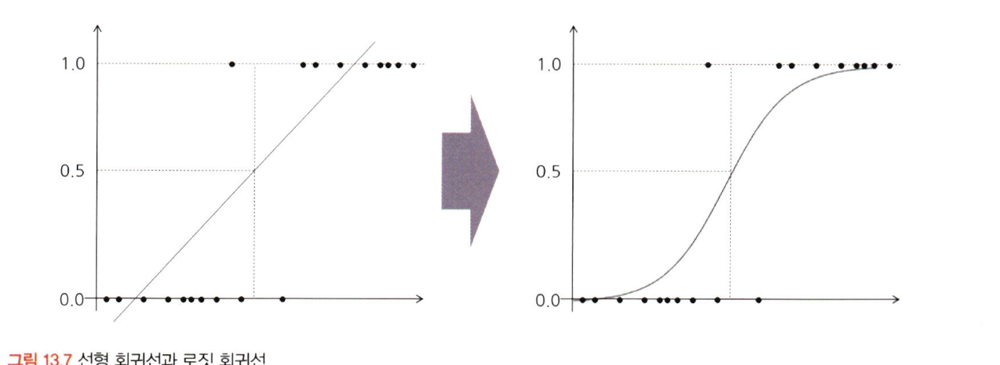
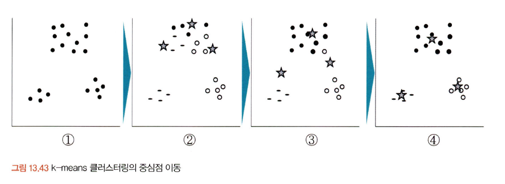
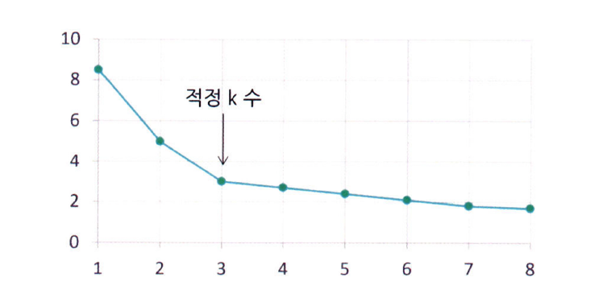

# 통계학 7주차 정규과제

📌통계학 정규과제는 매주 정해진 분량의 『*데이터 분석가가 반드시 알아야 할 모든 것*』 을 읽고 학습하는 것입니다. 이번 주는 아래의 **Statistics_7th_TIL**에 나열된 분량을 읽고 `학습 목표`에 맞게 공부하시면 됩니다.

아래의 문제를 풀어보며 학습 내용을 점검하세요. 문제를 해결하는 과정에서 개념을 스스로 정리하고, 필요한 경우 추가자료와 교재를 다시 참고하여 보완하는 것이 좋습니다.

7주차는 `3부. 데이터 분석하기`를 읽고 새롭게 배운 내용을 정리해주시면 됩니다.


## Statistics_7th_TIL

### 3부. 데이터 분석하기
### 13.머신러닝 분석 방법론
### 14.모델 평가


## Study Schedule

|주차 | 공부 범위     | 완료 여부 |
|----|----------------|----------|
|1주차| 1부 p.2~56     | ✅      |
|2주차| 1부 p.57~79    | ✅      | 
|3주차| 2부 p.82~120   | ✅      | 
|4주차| 2부 p.121~202  | ✅      | 
|5주차| 2부 p.203~254  | ✅      | 
|6주차| 3부 p.300~356  | ✅      | 
|7주차| 3부 p.357~615  | ✅      | 

<!-- 여기까진 그대로 둬 주세요-->

# 13.머신러닝 분석 방법론

```
✅ 학습 목표 :
* 선형 회귀와 다항 회귀를 비교하고, 데이터를 활용하여 적절한 회귀 모델을 구축할 수 있다. 
* 로지스틱 회귀 분석의 개념과 오즈(Odds)의 의미를 설명하고, 분류 문제에 적용할 수 있다.
* k-means 알고리즘의 원리를 설명하고, 적절한 군집 개수를 결정하여 데이터를 군집화할 수 있다.
```

## 13.1. 선형 회귀분석과 Elastic Net(예측모델)
* 회귀분석: 종속변수 Y값에 영향을 주는 독립변수 X들의 조건을 고려하여 구한 평균값
    * 즉, 예측치와 관측치들 간 수직 거리의 제곱합을 최소로 하는 직선
* 회귀조건
    * 잔차의 정규성
        * 회귀 계수의 신뢰구간, p값, F검정 같은 **통계적 추론(inference)**이 정확하게 동작하기 위한 전제
        * 회귀계수는 정규분포 없이 추정 가능하나, 계수 해석 및 검정에서 정규분포가 전제되어야 함.
    * 잔차의 등분산성
    * 독립성
    * 선형성

### 13.1.2 다항 회귀
* 다항 회귀: 독립변수와 종속변수 간 관계가 곡선형일 때, 변수에 각 특성 제곱 추가하여 곡선형 변경
* T-value: 독립변수와 종속변수 간 선형관계가 얼마나 강한지 나타냄.
* Tolerance와 VIF: 공차한계와 분산팽창지수 
    * 다중공선성 판단
        * 전진선택법
        * 후진제거법
        * 단계적 선택법
*  선형회귀 vs 다항회귀 비교
    | 항목 | 선형회귀 (Linear Regression) | 다항회귀 (Polynomial Regression) |
    |------|-------------------------------|------------------------------------|
    | **모델 유형** | 선형 모델 | 비선형 모델 (다항식 기반) |
    | **데이터 관계** | 독립변수와 종속변수 사이 선형 관계 가정 | 비선형 관계도 모델링 가능 |
    | **복잡도** | 단순 | 차수가 올라갈수록 복잡해짐 |
    | **과적합 위험** | 낮음 | 고차 다항식일수록 과적합 위험 증가 |
    | **해석 용이성** | 쉬움 | 다소 어려움 |
    | **시각적 형태** | 직선 | 곡선 (U자형, S자형 등) |


### 13.1.3 릿지와 랏쏘
* 릿지: 전체 변수를 모두 유지하며 계수 크기 조절 (L2 계수 정규화)
* 라쏘: 중요 변수 채택 후 나머지 변수 0으로 조절 (L1)
* Elasic net: 릿지와 라쏘의 최적화 지점이 다르기 때문에 두 정규화 항을 결합하여 절충한 모델


## 13.2. 로지스틱 회귀분석 (분류모델)
* 변수: 선형회귀분석과 달리 종속변수가 질척척도
    * 0과 1의 분류 모델
* 종속변수: 선형이 아닌, 0과 1사이의 S자 곡선의 형태를 갖도록 변환 



* 원리
    * 직선 형태의 회귀 값을 사건이 일어날 오즈 값으로 변환
    * 오즈 값에 로그를 취하면 양의 무한대에서 음의 무한대를 갖게 됨
    * 확률을 로짓으로 변환하여 0~1 사이로 치환 (시그모이드 함수)
* 다항 로지스틱 함수
    * 범주가 4개일 때 (종속변수 값이 4개), 다른 범주와 비교해서 식을 만듦

* 로지스틱 회귀의 R² 및 모델 평가 기준 비교

    | 항목 | 설명 |
    |------|------|
    | **선형 회귀의 R²** | 연속형 값에 대한 분산 기준으로 정의됨 |
    | **로지스틱 회귀의 R²** | 연속형이 아니므로 다른 방식으로 정의 필요. 공식적 방식만 10가지 이상 존재 |

## 13.8. k-means 클러스터링(군집모델)
* K-Means vs K-NN 비교

| 항목 | K-Means | K-NN |
|------|---------|------|
| **알고리즘 유형** | 비지도 학습 (Clustering) | 지도 학습 (Classification/Regression) |
| **목적** | 데이터를 군집화하여 그룹 찾기 | 새로운 데이터를 분류하거나 예측 |
| **입력 데이터** | 라벨 없는 데이터 | 라벨이 있는 학습 데이터 |
| **출력 결과** | 각 데이터가 속한 클러스터 | 입력 데이터의 클래스 또는 값 예측 |
| **중심 개념** | 중심점(centroid) 기준 거리 최소화 | 주변 이웃(k개)의 다수결 또는 평균 |
| **훈련 과정** | 클러스터 중심 반복 업데이트 | 훈련 없음 (Lazy Learning) |



* 단점
    * 지역 최솟값: 중심점과 군집 내 관측치 거리 값 최소
    * 전역 최솟값: 함수 전체 구간에서 최솟값 
        * 지역 최솟값에 빠지지 않게 여러 모델 사용
            * K-means ++



* 적절한 수 k선정
    * 비즈니스 도메인
    * 엘보우 기법
    * 실루엣 계수
        * 1에 가까울수록 적절하게 나눠짐

* DBSCAN: 밀도 기반 클러스터링
    * 기준값 설정
    * 이웃 관측치 수 설정
    * U자형, H자형 데이터 분포 클러스터링에도 효과적
* 주의
    * 군집의 차이를 확인하기 위해서는 t-test나 anova를 통한 통계적 유의미성 검토 필요


# 14. 모델 평가

```
✅ 학습 목표 :
* 유의확률(p-value)을 해석할 때 주의할 점을 설명할 수 있다.
* 분석가가 올바른 주관적 판단을 위한 필수 요소를 식별할 수 있다.
```

## 14.3. 회귀성능 평가지표
> R-square와 수정 R-square
* R-square는 SSR이 클수록, SST 값이 작을수록 커지게 됨

> RMSE
* 편자 제곱의 평균의 제곱근
* 실제값과 예측값의 표준편차 
* 수치를 맞춘 비율이 아닌, 실제 수치와의 차이를 비교
* 표본평균과 비교 시 변동성 예측 가능

> MAE
* 실제값과 예측값 차이를 절대값 합 n으로 나눔 (평균 절대 오차)
* RMSE보다 이상치에 덜 민감

> MAPE
* MAE를 퍼센트로 변환
* 0에 가까울수록 우수 모델 

> RMSLE
* RMSE과 동일한 수식에서 실제값과 예측값에 1을 더해준 다음 로그
* RMSE보다 오차 이상치에 덜 민감
* 상대적 비교 가능

> AIC와 BIC
* AIC: 최대우도에 독립변수가 얼마나 많은지
* 

## 14.6. 유의확률의 함정
* p값은 표본이 커지면 점점 0으로 수렴함
* 0.05는 통상적 기준이지 절대적 기준이 아님


## 14.7. 분석가의 주관적 판단과 스토리텔링
* 데이터는 무조건 객관적인 진실을 나타내지 않으며, 인사이트 도출을 위해서는 분석가의 배경지식과 판단이 필요함
    * 도메인 지식
    * EDA와 전처리
    * 적극적 커뮤니케이션과 검증


<br>
<br>

# 확인 문제

## **문제 1. 선형 회귀**

> **🧚 칼 피어슨의 아버지와 아들의 키 연구 결과를 바탕으로, 다음 선형 회귀식을 해석하세요.**  
> 칼 피어슨(Karl Pearson)은 아버지(X)와 아들(Y)의 키를 조사한 결과를 바탕으로 아래와 같은 선형 회귀식을 도출하였습니다. 아래의 선형 회귀식을 보고 기울기의 의미를 설명하세요. 
>  
> **ŷ = 33.73 + 0.516X**  
>   
> - **X**: 아버지의 키 (cm)  
> - **ŷ**: 아들의 예상 키 (cm)  

```
아버지의 키가 1cm 증가하면, 아들의 예상키가 평균적으로 0.516 증가한다는 뜻이다. 그러나, 기울기가 1보다 작다는 것은 아버지의 키가 많이 크더라도 아들의 키는 아버지보다 약간 작을 가능성이 높다는 것이다.
```
---

## **문제 2. 로지스틱 회귀**  

> **🧚 다트비에서는 학생의 학업 성취도를 예측하기 위해 다항 로지스틱 회귀 분석을 수행하였습니다. 학업 성취도(Y)는 ‘낮음’, ‘보통’, ‘높음’ 3가지 범주로 구분되며, 독립 변수는 주당 공부 시간(Study Hours)과 출석률(Attendance Rate)입니다. 단, 기준범주는 '낮음' 입니다.**   

| 변수 | Odds Ratio Estimates | 95% Wald Confidence Limits |  
|------|----------------------|--------------------------|  
| Study Hours | **2.34** | (1.89, 2.88) |  
| Attendance Rate | **3.87** | (2.92, 5.13) |  

> 🔍 Q1. Odds Ratio Estimates(오즈비, OR)의 의미를 해석하세요.

<!--변수 Study Hours의 오즈비 값이 2.34라는 것과 Attendance Rate의 오즈비 값이 3.87이라는 것이 각각 무엇을 의미하는지 구체적으로 생각해보세요.-->

```
study hourse의 오즈비 값이 2.34라는 것은 주당 공부시간이 1 증가할 때, 보통 혹은 높음의 학업 성취도를 가질 가능성이 기준 범주인 낮음에 비해 2.34배 높다는 뜻.
공부 시간이 많으면 학업 성취도가 올라간다는 의미.

ttendance Rate의 오즈비 값이 3.87이라는 것은 주당 공부시간이 1 증가할 때, 보통 혹은 높음의 학업 성취도를 가질 가능성이 기준 범주인 낮음에 비해 3.87배 높다는 뜻.
출석률이 높으면 더 높은 학업 성취도를 보인다는 의미
```

> 🔍 Q2. 95% Wald Confidence Limits의 의미를 설명하세요.
<!--각 변수의 신뢰구간에 제시된 수치가 의미하는 바를 생각해보세요.-->

```
각 변수의 신뢰구간은 모델 반복 시 95% 확률로 이 범위 안에 들어갈 것이라는 의미이다. 이 구간이 1을 포함하지 않기에, 각 변수는 통계적으로 유의미하다.
```

> 🔍 Q3. 이 분석을 기반으로 학업 성취도를 향상시키기 위한 전략을 제안하세요.
<!--Study Hours와 Attendance Rate 중 어느 변수가 학업 성취도에 더 큰 영향을 미치는지를 고려하여, 학업 성취도를 향상시키기 위한 효과적인 전략을 구체적으로 제시해보세요.-->

```
두 변수 중 Attendance Rate가 학업 성취도에 큰 영향을 미치며, 이를 바탕으로 출석율을 높이는 전략을 제시해야 한다. 예를 들어, 출석에 대한 가산점 제도가 대표적인 전략이 될 수 있다. 
```

---


## **문제 3. k-means 클러스터링**

> **🧚 선교는 고객을 유사한 그룹으로 분류하기 위해 k-means 클러스터링을 적용했습니다. 초기에는 3개의 군집으로 설정했지만, 결과가 만족스럽지 않았습니다. 선교가 최적의 군집 수를 찾기 위해 사용할 수 있는 방법을 한 가지 이상 제시하고 설명하세요.**

```
k를 설정하는 방법은 비즈니스 지식 이용, 엘보우 방법, 실루엣 계수가 존재한다. 엘보우 방법을 이용하면, 클러스터 수에 따른 총제곱오차합을 계산하며 값이 완만해지는 지점의 k값을 클러스터 수로 사용 가능하다. 또한, 실루엣 계수는 같은 클러스터 내 유사성과 다른 클러스터링의 차이를 고려하여 평균 실루엣 계수가 가장 높은 K를 선택할 수 있다.

```

### 🎉 수고하셨습니다.