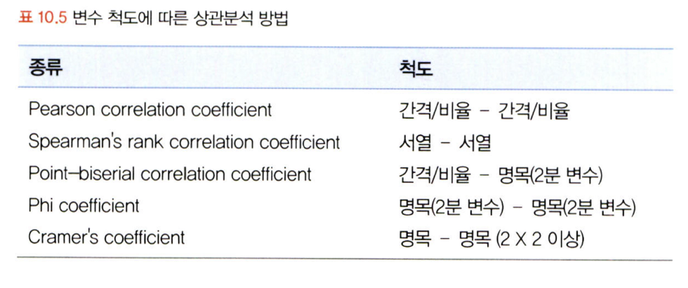

# 통계학 4주차 정규과제

📌통계학 정규과제는 매주 정해진 분량의 『*데이터 분석가가 반드시 알아야 할 모든 것*』 을 읽고 학습하는 것입니다. 이번 주는 아래의 **Statistics_4th_TIL**에 나열된 분량을 읽고 `학습 목표`에 맞게 공부하시면 됩니다.

아래의 문제를 풀어보며 학습 내용을 점검하세요. 문제를 해결하는 과정에서 개념을 스스로 정리하고, 필요한 경우 추가자료와 교재를 다시 참고하여 보완하는 것이 좋습니다.

4주차는 `2부. 데이터 분석 준비하기`를 읽고 새롭게 배운 내용을 정리해주시면 됩니다.


## Statistics_4th_TIL

### 2부. 데이터 분석 준비하기
### 10. 데이터 탐색과 시각화


## Study Schedule

|주차 | 공부 범위     | 완료 여부 |
|----|----------------|----------|
|1주차| 1부 p.2~56     | ✅      |
|2주차| 1부 p.57~79    | ✅      | 
|3주차| 2부 p.82~120   | ✅      | 
|4주차| 2부 p.121~202  | ✅      | 
|5주차| 2부 p.203~254  | 🍽️      | 
|6주차| 3부 p.300~356  | 🍽️      | 
|7주차| 3부 p.357~615  | 🍽️      | 

<!-- 여기까진 그대로 둬 주세요-->

# 10. 데이터 탐색과 시각화

```
✅ 학습 목표 :
* EDA의 목적을 설명할 수 있다.
* 주어진 데이터셋에서 이상치, 누락값, 분포 등을 식별하고 EDA 결과를 바탕으로 데이터셋의 특징을 해석할 수 있다.
* 공분산과 상관계수를 활용하여 두 변수 간의 관계를 해석할 수 있다.
* 적절한 시각화 기법을 선택하여 데이터의 특성을 효과적으로 전달할 수 있다.
```

## 10.1 탐색적 데이터 분색 
* 정의 
    * 기술통계와 시각화를 통해 데이터 특성 파악 
* 주의
    * 극단적 해석 피하기
    * 지나친 추론과 자의적 해석 지양  
* 목적
    * 데이터의 형태와 척도가 분석에 알맞게 되어있는지
    * 데이터의 평균, 분산, 분포, 패턴 등의 확인을 통해 데이터 특성 파악
    * 데이터 결측값이나 이상치 파악 및 보완
    * 변수 간의 관계성 파악
    * 분석 목적과 방향성 점검 및 보정

### 10.1.2 탐색적 데이터 분석(EDA)
* 데이터 임포트: import 데이터 전처리 = pandas, 데이터 시각화 = seaborn, matplotlib
* 데이터 불러오기: df = pd.read_csv("datasets/hotel_bookings.csv")
* 데이터 샘플 확인: df.head()
* 각 칼럼 속성 확인: df.info()
    * 데이터 타입
    * 결측치 확인
* 각 칼럼의 통계치 확인: df.describe()
* 각 칼럼의 왜도 확인: df.skew()
* 각 칼럼의 첨도 확인: df.kurtosis
* 특정 변수 분포 시각화: sns.distplot()
* 그룹 구분에 따른 특정 변수 분포 시각화: sns.violinplot()

## 10.2 공분산과 상관성 분석
* 변수 간 관계 파악
    * 입력변수 X와 타깃 변수 Y 혹은 입력변수 X간 관계 파악
* 목적
    * 다중공선성 방지
    * 데이터 이해도 제고
* 방법
    * 공분산
    * 상관성 분석
* 전제
    * 데이터 타입 = 등간 or 비율 
    * 두 변수 = 선형적 관계
* 시각화 시
    * 수치적으로 의미없는 변수는 drop()
    * cov(), corr() 함수는 알아서 문자형 변수 제외
    * sns.clustermap()은 상관계수 표시 O
    * sns.heatmap()은 상관계수 표시 X
    * 가독성을 높이기 위해 중복 영역을 제거하면 좋음

### 10.2.1 공분산
* 정의
    * 두 분산 간의 관계 
* 공식
    * 각 변수의 각 변수 편차곱의 합 / 전체 관측치 개수
    * 표본이면 (전체 관측치 개수 - 1)

### 10.2.2 상관계수
* 정의
    * 공분산을 각각 표준편차로 나누어 정규화한 값
* 공식
    * 공분산 / 각 변수의 표준편차의 곱
* 해석
    * 매트릭스 구조의 상관분석 표나 히트맵으로
    * 0.7 이상 = 상관관계 높다
    * 0.4 이상 = 어느 정도 상관관계
* 주의
    * 산점도의 기울기와 상관계수는 관련없음
* 결정계수 (R^2)
    * 상관계수의 제곱
    * 총 변동 중 회귀선에 의해 설명되는 변동 비율 




## 10.3 시간 시각화
* 목적
    * 전체적 흐름 파악
    * 데이터 트렌드 및 노이즈 파악 
* 방법
    * 선그래프 형태인 연속형
        * 시간 간격 밀도가 높을 때 사용
        * 양이 방대하면 추세선을 삽입해 데이터 흐름을 안정된 선으로 표현 
    * 막대그래프 형태인 분절형
        * 시간 간격 밀도가 낮을 때 사용
        * 값들의 상대적 차이를 나타내는 것에 유리
* 시각화
    * 이동평균을 활용한 추세선: df_line['새 칼럼'] = df_line['y값'].rolling(window=n).mean
        * 일 매출로 추이 파악이 안될 때 사용 가능

## 10.4 비교 시각화
* 목적
    * 그룹별 요소가 많아지면 막대 그래프로 시각화하기 어려움
    * 이때, 히트맵을 이용하여 비교요소가 많은 시각화 가능 
    * 각 행과 열을 비교할 수 있다는 장점
* 방법1: 히트맵 차트
    * 히트맵 차트 표현 방법
        * 하나의 변수(그룹) * n개의 각 변수에 해당하는 값들 (수치형)
        * 하나의 변수(그룹) * 하나의 변수(그룹/수준) * 하나의 변수(수준)
    * 주의
        * 그리는 방법이 까다롭기에 현재 데이터 구조와 목적 파악한 후 사용
        * 적정 수준으로 데이터 정제 후 사용 
* 방법2: 방사형 차트
    * 방사형 차트 표현 방법
        * 하나의 차트에 하나의 그룹을 시각화 (하나의 그룹 * N개의 변수)
        * 하나의 차트에 모든 그룹을 한 번에 시각화 (N개의 그룹 * N)
* 방법3: 그룹별 요소 비교 시각화 by 평형 좌표 그래프
    * 정규화 시 효과적으로 표현 가능

## 10.5 분포 시각화
* 목적
    * 변수들이 어떤 요소로 어떤 비율로 구성되어 있는지 파악
* 양적 척도일 때
    * 막대그래프, 선그래프, 히스토그램 이용 
        * 히스토그램 이용시 구간 수를 적절하게 선정하기
* 질적 척도일 때
    * 구성요소 단순: 파이차트, 도넛차트 이용
    * 구성요소 복잡: 트리맵 차트(위계 질서 표현 가능), 와플차트(위계구조 표현X)

## 10.6 관계 시각화
* 목적
    * 점들의 분포와 추세를 통해 두 변수 관계 파악
* 주의
    * 극단치로 인해 분포 구간이 압축되기에, 극단치 제거하고 표현하기
    * 점들이 겹친다면 투명도 조절하기
    * 버블차트를 이용하여 세 가지 요소의 상관관계 표현 가능
        * 관측치가 100개 넘어갈 경우 사용 주의
        * 원의 지름이 아닌 면적으로 해석

## 10.7 공간 시각화
* 목적
    * 지도 위에 데이터 표현 시 데이터를 명확하고 직관적으로 볼 수 있음 
    * 인터렉티브한 활용이 가능하기에 거시적에서 미시적으로 진행되는 분석 방향과 같이 스토리라인 잡고 시각화하기 좋음
* 방법
    * 도트맵
        * 지리적 위치에 동일한 크기의 점을 찍어 해당 지역의 분포나 패턴 표현
        * 데이터 개요 파악에 좋음 / 정확한 값 전달X
    * 버블맵
        * 데이터 값이 원의 크기로 표현됨
        * 비율 비교 효과적 / 영역 중복 주의
    * 코로플레스맵
        * 데이터 값의 크기에 따라 색상의 음영을 달리하여 해당 지역에 대한 값 시각화
        * 투명도, 채도, 명도 다양하게 혼합 가능 / 정확한 값 전달X
    * 커넥션맵
        * 지도에 찍힌 점들을 곡선 또는 직선으로 연결
        * 지리적 관계 패턴 파악 가능 
* 시각화 시
    * 공간 시각화 folium, plotly 등 패키지 이용 

## 10.8 박스 플롯
* 목적 
    * 하나의 그림으로 양적 척도 데이터 분포, 편향성, 중앙값 등을 볼 수 있음 (평균은 추가 옵션)
* 수치: 최솟값 / 제1~3분위 / 최대값 / 평균 / 중앙값 파악 가능 
    * 예를 들어, 중앙값이 다소 아래에 있다면 오른쪽으로 치우친 분포를
    * 최솟값이 최솟값 범위보다 높다면 왼쪽으로 데이터가 적게 퍼짐
    * 또한, 오른쪽에 이상치가 분포한다면 오른쪽 꼬리가 긴 분포임을 확인 가능 

<br>
<br>

# 확인 문제

## 문제 1.
> **🧚 공분산과 상관계수의 차이점에 대해 간단히 설명하세요.**

```
공분산은 두 분산의 관계를 나타낸 것이며, 상관계수는 두 분산의 관계인 공분산을 각 변수의 표준편차로 나눠 정규화한 것이다.
```

## 문제 2.
> **🧚 다음 데이터 분석 목표에 적합한 시각화 방법을 보기에서 모두 골라 연결해주세요.**

> 보기: 산점도, 선그래프, 막대그래프, 히스토그램, 박스플롯

(a) 변수의 분포 확인   
(b) 두 변수 간의 관계 확인   
(c) 집단별 평균 비교   
(d) 시계열 데이터 분석

<!--중복 가능-->

```
(a) - 산점도, 히스토그램, 박스플롯
(b) - 산점도
(c) - 선그래프, 막대그래프
(d) - 선그래프
```


### 🎉 수고하셨습니다.